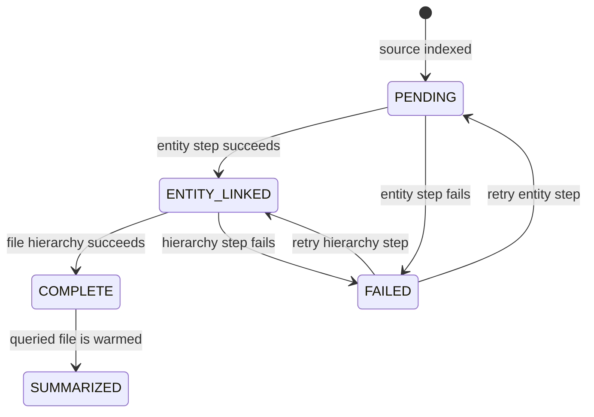

<!-- docs/ENRICHMENT.md -->
# Background Enrichment

Enrichment improves an already-searchable collection. It is not indexing and it
is not a prerequisite for retrieval.

## Ownership

Foreground indexing owns:

- parsing source files;
- storing raw source, sections, symbols, tables, and FTS5 rows;
- deterministic code-import resolution.

Background enrichment owns:

- entity and temporal metadata extraction;
- entity-graph population;
- per-file hierarchy summaries;
- the corpus hierarchy summary;
- summaries generated on demand for queried files.

Fitz-Sage does not use enrichment to normalize source identifiers, repair
abbreviations, rewrite logs, compress documents, or infer that differently
spelled values are equivalent. Document preparation and domain mapping remain
user-owned.

## State Machine



The file remains `INDEXED` through every enrichment transition. Collection
hierarchy finalization has its own `PENDING`, `COMPLETE`, or `FAILED` state.

## Scheduling

`BackgroundEnrichmentWorker` processes smaller and higher-priority files first.
Files returned by a query move to priority 1; their directory siblings move to
priority 2. The worker pauses before model work while a query is active.

The in-process worker begins after `point()` returns. A short-lived CLI process
stops that thread and launches the hidden `enrichment-daemon` when work remains.
The manifest is written atomically so the query process and detached process
never observe partial JSON.

## Failure Behavior

Per-file model errors are recorded under `enrichment.failed_files`. They do not
change source-index health and do not delete searchable data. A later
`continue_enrichment()` retries from the last durable stage.

Use:

```python
engine.continue_enrichment()   # synchronous completion attempt
engine.wait_for_enrichment()   # wait for the current in-process worker
engine.stop_background_enrichment()
```

## Qwen Work

The managed local Qwen runtime is loaded only when an enrichment operation or a
query-time semantic-keyword operation actually needs it. `point()` does not
ensure, load, or call Qwen.

There is no ingestion-time keyword generation. This removes duplicated semantic
work from every document and keeps the source-index latency proportional to
parsing and SQLite writes. Query-time semantic expansion remains bounded to the
queries users actually make.

## Demand Summaries

Source sections are rerankable before summaries exist because retrieval supplies
a bounded source excerpt. Once a query surfaces a file, the warm loop may
generate and persist its summary. Unqueried files are not summarized eagerly.

## Related

- [Ingestion Pipeline](INGESTION.md)
- [Managed Models](MANAGED_MODELS.md)
- [Entity Graph](features/retrieval/entity-graph.md)
