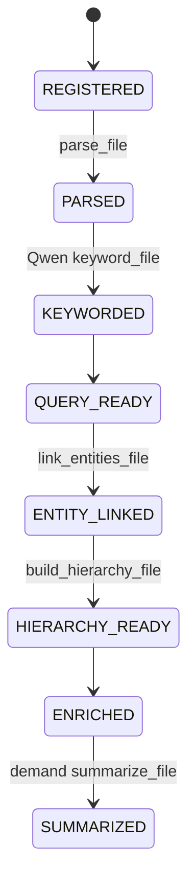

<!-- docs/ENRICHMENT.md -->
# Enrichment

Enrichment is required retrieval infrastructure. It is not a feature flag and
it is not delegated to a user-selected endpoint. fitz-sage uses its managed
Qwen3.5 0.8B ONNX runtime on CPU for the metadata that makes retrieval work.

The first query does not wait for every enrichment stage. It waits for a parsed
search surface, returns governed evidence, and lets the background daemon finish
keyword, entity, hierarchy, and demand-summary work.

---

## Staged Model



| Stage | Blocks first evidence pack? | Runtime | Purpose |
|-------|-----------------------------|---------|---------|
| Parse | yes | CPU parser / AST / table parsers | Store raw content, sections, symbols, tables. |
| Keyword | no | managed Qwen ONNX | Add semantic keywords and aliases for broad recall. |
| Entity link | no | managed Qwen ONNX + SQLite | Populate entity graph links for expansion. |
| Hierarchy | no | managed Qwen ONNX | Build L1 file summaries and L2 corpus overview. |
| Demand summary | no | managed Qwen ONNX | Summarize only files that queries actually surfaced. |

The CLI prints `Search surface ready; enrichment continues.` when parsing has
finished and retrieval can start. If later stages remain, it spawns
`index-daemon` so enrichment continues after the command exits.

---

## What Qwen Adds

### Keywords

Exact and semantic retrieval terms: identifiers, aliases, domain terms,
acronyms, issue IDs, version strings, endpoint names, class names, and
near-synonyms that improve broad BM25 recall.

Examples: `TC-1001`, `JIRA-4521`, `v2.0.1`, `AuthService`,
`MAX_RETRIES`, `/api/v2/users`, `database`, `configuration`.

### Entities

Named concepts used for graph expansion after the initial ranking:

- classes and functions
- people and organizations
- technologies and products
- business concepts

Entities are stored on each symbol/section and fed into
`EntityGraphStore`, so later queries can expand from one source unit to related
units.

### Temporal Metadata

Dates, version numbers, quarters, release names, and relative time references
that help temporal/freshness retrieval.

### Hierarchy

Document collections get hierarchy summaries:

- **L1:** one per-file group summary, stored on section metadata.
- **L2:** one corpus overview, stored as a synthetic retrievable section.

These summaries help broad analytical queries such as "What are the main
themes?" after deep enrichment has completed. They are not required for the
near-instant first evidence pack.

---

## Query-Time Semantic Keywords

The default no-endpoint query path still uses managed Qwen. During query prep,
fitz-sage asks Qwen for a small keyword-only expansion and merges those terms
with deterministic query terms and dictionary synonyms/acronyms.

That keyword set becomes one extra BM25 leg in broad recall. It is cheap and
recall-oriented; precision belongs to the ONNX reranker and Pyrrho cutoff.

---

## Failure Semantics

Enrichment fails closed. If required Qwen keyword enrichment fails for a file,
the worker stops before marking the collection query-ready. If deep enrichment
fails, finalization is skipped and the status reports remaining deep work.

The engine does not silently store a "good enough" fully indexed collection
without the metadata the retrieval pipeline relies on.

---

## Configuration

There is no public provider config for Qwen enrichment. It is the standard
runtime:

```yaml
summary_batch_size: 15
```

`summary_batch_size` controls enrichment batch size. The managed model bundle
is downloaded through `huggingface-hub` on first use and cached locally.

To inspect the exact managed model snapshot:

```python
from fitz_sage.llm.providers.onnx_chat import OnnxChat

info = OnnxChat().model_info(include_checksum=True)
print(info.repo_id, info.revision, info.onnx_path, info.checksum)
```

---

## Key Files

| File | Purpose |
|------|---------|
| `fitz_sage/engines/fitz_krag/ingestion/pipeline.py` | `KragIngestPipeline` parse/keyword/entity/hierarchy/finalize operations |
| `fitz_sage/engines/fitz_krag/ingestion/enricher.py` | Batched keyword/entity/temporal extraction |
| `fitz_sage/engines/fitz_krag/progressive/worker.py` | Background worker state machine |
| `fitz_sage/llm/providers/onnx_chat.py` | Managed Qwen3.5 0.8B ONNX runtime |
| `fitz_sage/retrieval/entity_graph/` | Entity graph store populated from extracted entities |

---

## See Also

- [RETRIEVAL_PIPELINE.md](RETRIEVAL_PIPELINE.md) - query flow and indexing states
- [INGESTION.md](INGESTION.md) - ingestion pipeline
- [CONFIG.md](CONFIG.md) - configuration reference
- [features/retrieval/query-expansion.md](features/retrieval/query-expansion.md) - query-time keyword expansion
