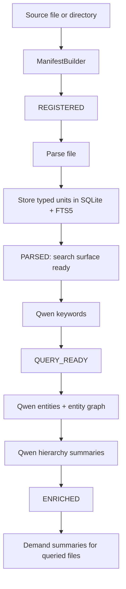

<!-- docs/INGESTION.md -->
# Ingestion Pipeline

fitz-sage does not expose a separate `ingest` command. Ingestion starts when
you point a query at a source:

```bash
fitz query "Which documents are relevant?"
fitz query "Which documents are relevant?" --source ./docs
```

The foreground command waits only until parsed retrieval units are searchable.
Managed Qwen enrichment continues in the background.

---

## Pipeline Overview



The same `KragIngestPipeline` core performs the work whether it is called from
the foreground command, the in-process worker thread, or the detached
`index-daemon`.

---

## Stages

### 1. Manifest Build

`ManifestBuilder` scans the source, hashes files, extracts cheap structural
hints, and records every file under `.fitz/collections/<collection>/`.

For code, it records function/class/method names and line ranges when available.
For prose, it records headings. This stage has no LLM calls.

### 2. Parse

`parse_file` stores raw content and typed units:

| Content | Stored unit | Store |
|---------|-------------|-------|
| Python / TypeScript / Java / Go | symbols | `SymbolStore` |
| Markdown, text, rich documents | sections | `SectionStore` |
| CSV / TSV / tables | table metadata and native table data | `TableStore` / `SqliteTableStore` |
| Generic fallback text | file/section fallback | `SectionStore` |

After parse, FTS5/BM25 can already search the collection. This is the gate the
CLI waits for before returning the first evidence pack.

### 3. Keyword Enrichment

`keyword_file` uses managed Qwen3 0.6B ONNX GenAI to add semantic keywords and
aliases. Once a file reaches `QUERY_READY`, it has the minimum Qwen enrichment
needed by steady-state retrieval.

### 4. Deep Enrichment

Deep enrichment continues after the first query:

- `link_entities_file` populates entity metadata and the entity graph.
- `build_hierarchy_file` creates L1 per-file hierarchy summaries.
- `finalize` creates corpus-level structures such as import graph rollups and
  the L2 corpus overview.

Deep enrichment is mandatory for the full index, but it does not block the
first evidence pack.

### 5. Demand Summaries

Summaries for individual surfaced files are generated after the file has been
queried. Files no query ever touches are not summarized eagerly. This keeps the
first-run cost focused on the metadata that moves retrieval quality most.

---

## Indexing Status

`indexing_status()` reports both query readiness and deep enrichment:

```json
{
  "total": 65,
  "indexed": 63,
  "pending": 2,
  "complete": false,
  "query_ready": false,
  "deep_pending": 40,
  "fully_enriched": false,
  "by_state": {
    "parsed": 2,
    "query_ready": 23,
    "enriched": 40
  }
}
```

`complete` means all files are at least query-ready. `fully_enriched` means the
entity/hierarchy stages are done too.

---

## File Format Support

| Format | Path |
|--------|------|
| `.pdf` | `parser: cpu` by default; `docling`, `docling_vision`, or `glm_ocr` are optional heavier parsers |
| `.docx`, `.pptx` | Docling-backed document parsing when installed |
| `.md`, `.rst`, `.txt` | section extraction and heading-aware storage |
| `.py` | AST-backed symbol extraction |
| `.ts`, `.tsx`, `.js`, `.jsx`, `.java`, `.go` | tree-sitter-backed symbol extraction when grammar packages are installed |
| `.csv`, `.tsv` | native SQLite table storage plus table metadata search |
| `.json`, `.yaml`, `.sql` | text/section fallback |

Unsupported files are skipped rather than forcing a broken generic parse.

---

## CLI Usage

```bash
# Default: current directory is the source
fitz query "What is in this corpus?"

# Explicit source and collection
fitz query "What is in this corpus?" --source ./docs --collection docs

# Evidence controls
fitz retrieve "What is in this corpus?" --source ./docs --top-k 8
```

---

## Python API

```python
import fitz_sage

pack = fitz_sage.evidence("Which documents are relevant?", source="./docs")
for item in pack.items:
    print(item.file_path, item.excerpt)
```

Advanced lifecycle:

```python
from pathlib import Path

from fitz_sage import Query, create_engine

engine = create_engine("fitz_krag")
engine.load("my_collection")
engine.point(Path("./docs"), collection="my_collection")
engine.wait_for_query_surface()

pack = engine.evidence(Query(text="What is in these docs?"))
status = engine.indexing_status()
```

Use `wait_for_indexing()` only when you explicitly want to block until the
query-ready keyword phase completes. Deep enrichment may still continue after
that until `fully_enriched` is true.

---

## Key Files

| File | Purpose |
|------|---------|
| `fitz_sage/engines/fitz_krag/progressive/builder.py` | fast source scan and manifest construction |
| `fitz_sage/engines/fitz_krag/progressive/manifest.py` | file state machine and indexing status |
| `fitz_sage/engines/fitz_krag/progressive/worker.py` | background worker and detached daemon path |
| `fitz_sage/engines/fitz_krag/ingestion/pipeline.py` | parse/keyword/entity/hierarchy/finalize core |
| `fitz_sage/engines/fitz_krag/ingestion/enricher.py` | Qwen keyword/entity/temporal extraction |
| `fitz_sage/engines/fitz_krag/ingestion/section_store.py` | document section storage and FTS5 search |
| `fitz_sage/engines/fitz_krag/ingestion/symbol_store.py` | code symbol storage and FTS5 search |
| `fitz_sage/engines/fitz_krag/ingestion/table_store.py` | table metadata storage |

---

## See Also

- [RETRIEVAL_PIPELINE.md](RETRIEVAL_PIPELINE.md) - query flow and indexing states
- [ENRICHMENT.md](ENRICHMENT.md) - managed Qwen enrichment details
- [CONFIG.md](CONFIG.md) - configuration reference
- [features/platform/progressive-krag-agentic-search.md](features/platform/progressive-krag-agentic-search.md)
