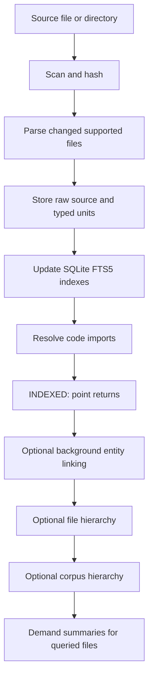

<!-- docs/INGESTION.md -->
# Ingestion Pipeline

Fitz-Sage has one explicit indexing boundary:

```python
manifest = engine.point(source, collection="docs")
```

When `point()` returns, every supported file is either searchable through the
ordinary SQLite/FTS5 retrieval path or listed as an indexing failure. Query
readiness never depends on Qwen, model download, entity extraction, or summary
generation.

The CLI calls the same operation automatically:

```bash
fitz retrieve "Which documents are relevant?" --source ./docs
```

## Pipeline



There is no secondary pre-index search path. A query reads the persisted source
index regardless of enrichment state.

## Foreground Indexing

### Discovery and Change Detection

`ManifestBuilder` scans enabled file extensions and hashes file bytes. An
unchanged file keeps its existing index and enrichment state. A changed file
returns to `REGISTERED`; removed files are deleted from all stores.

Discovery does not parse files and does not invoke a model.

### Parsing and Storage

`KragIngestPipeline.parse_file()` stores raw source and typed retrieval units:

| Content | Searchable unit | Store |
|---|---|---|
| Python, TypeScript, Java, Go | symbols | `SymbolStore` |
| Markdown, text, configuration, rich documents | sections | `SectionStore` |
| Configured delimited files (`.csv`, `.tsv` by default) | table metadata and rows | `TableStore` / `SqliteTableStore` |

Documents are searchable using their source text immediately. Missing
model-generated summaries fall back to bounded source excerpts for reranking.

### Import Resolution

After all changed files are stored, `resolve_imports()` connects code imports to
the indexed target files. This is deterministic and remains part of the
foreground indexing contract.

## Background Enrichment

After `point()` returns, an optional worker can add:

- entities and temporal metadata;
- per-file hierarchy summaries;
- a corpus hierarchy summary;
- demand summaries for files surfaced by queries.

This state is tracked separately from source indexing. An enrichment failure
does not remove source text, sections, symbols, tables, or query availability.
The CLI can hand pending work to the hidden `enrichment-daemon` after returning
evidence.

Fitz-Sage does not generate per-file semantic keyword aliases during ingestion.
Literal source terms are indexed directly and query-time semantic keywords
remain available. Applications that need domain mappings must preprocess their
data or queries; there is no public mapping hook.

## Status Contract

`indexing_status()` separates source-index health from optional enrichment:

```json
{
  "discovered": 67,
  "total": 65,
  "indexed": 64,
  "pending": 0,
  "failed": 1,
  "unsupported": 2,
  "healthy": false,
  "complete": false,
  "query_ready": true,
  "by_index_state": {
    "indexed": 64,
    "failed": 1,
    "unsupported": 2
  },
  "enrichment": {
    "total": 64,
    "completed": 40,
    "pending": 23,
    "failed": 1,
    "finalization": "pending",
    "complete": false
  },
  "by_enrichment_state": {
    "complete": 40,
    "pending": 23,
    "failed": 1
  }
}
```

- `query_ready` means no supported file is still waiting to be indexed.
- `complete` means indexing settled without a supported-file failure.
- `failed_files` contains source-index failures.
- `enrichment.failed_files` contains optional enrichment failures.
- `unsupported_files` contains files outside the enabled format contract.

These conditions are never silently represented as success.

## Parser Selection

| Format | Default `parser: cpu` path |
|---|---|
| `.pdf` | deterministic CPU PDF parser |
| `.docx` | lightweight DOCX parser |
| `.pptx` | lightweight PPTX parser |
| `.md`, `.rst`, `.txt`, config and markup formats | plaintext/section parser |
| `.py` | Python symbol extraction |
| `.ts`, `.tsx`, `.js`, `.jsx`, `.java`, `.go` | language-specific symbol extraction |
| `.csv`, `.tsv` | native table storage and row-value FTS |

Installing Docling does not change the CPU parser's behavior. Select `docling`,
`docling_vision`, or `glm_ocr` explicitly when those heavier parser contracts
are wanted. Unsupported files and files with no extractable searchable content
are reported.

## Python Lifecycle

```python
from pathlib import Path

from fitz_sage import Query, create_engine

engine = create_engine("fitz_krag")
engine.load("my_collection")
engine.point(Path("./docs"), collection="my_collection")

# The source index is searchable now.
pack = engine.evidence(Query(text="What is in these docs?"))

# Optional: block for entity and hierarchy enrichment.
engine.wait_for_enrichment()
status = engine.indexing_status()
```

## Throughput Benchmark

The dedicated benchmark measures only the query-ready contract:

```bash
python -m benchmarks.fitz_bench.ingestion_benchmark \
  --source benchmarks/corpora/core \
  --iterations 3 \
  --target-files-per-second 1
```

It calls `point(..., start_worker=False)`, reports cold files per second,
indexing failures, and no-change re-point time, proves the re-point leaves the
manifest and retrieval-unit counts unchanged, and exits nonzero when the target
is missed.

For real-file capacity and recovery testing, the external benchmark downloads
verified, unchanged selections from the public NapierOne corpus:

```bash
python -m benchmarks.fitz_bench.external_ingestion_benchmark \
  --profile tiny \
  --type PDF \
  --type DOCX \
  --type PPTX
```

It records per-format outcomes, file-size distribution, SQLite storage,
process peak RSS, and exact convergence after a hard process exit. Corpus files
and generated reports remain local and are not part of the package.

## Key Files

| File | Purpose |
|---|---|
| `fitz_sage/engines/fitz_krag/progressive/builder.py` | source scan and manifest construction |
| `fitz_sage/engines/fitz_krag/progressive/manifest.py` | independent index and enrichment state |
| `fitz_sage/engines/fitz_krag/progressive/worker.py` | background enrichment scheduler |
| `fitz_sage/engines/fitz_krag/ingestion/pipeline.py` | indexing and enrichment operations |
| `fitz_sage/engines/fitz_krag/ingestion/section_store.py` | document section storage and FTS5 |
| `fitz_sage/engines/fitz_krag/ingestion/symbol_store.py` | code symbol storage and FTS5 |
| `fitz_sage/engines/fitz_krag/ingestion/table_store.py` | table metadata storage |

## See Also

- [Enrichment](ENRICHMENT.md)
- [Retrieval Pipeline](RETRIEVAL_PIPELINE.md)
- [Searchable Index and Background Enrichment](features/platform/searchable-index-background-enrichment.md)
