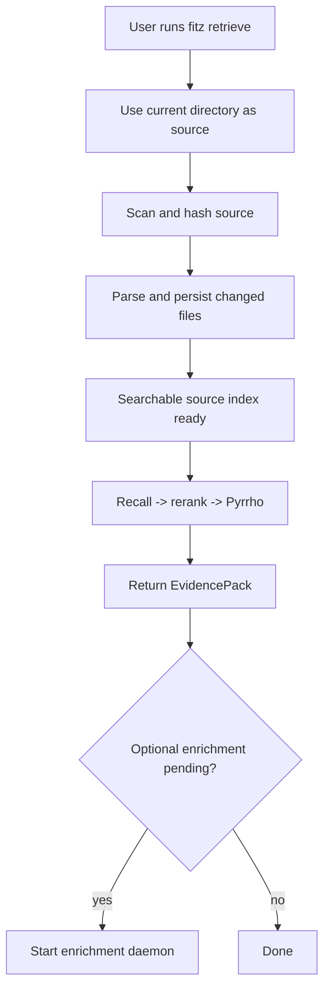
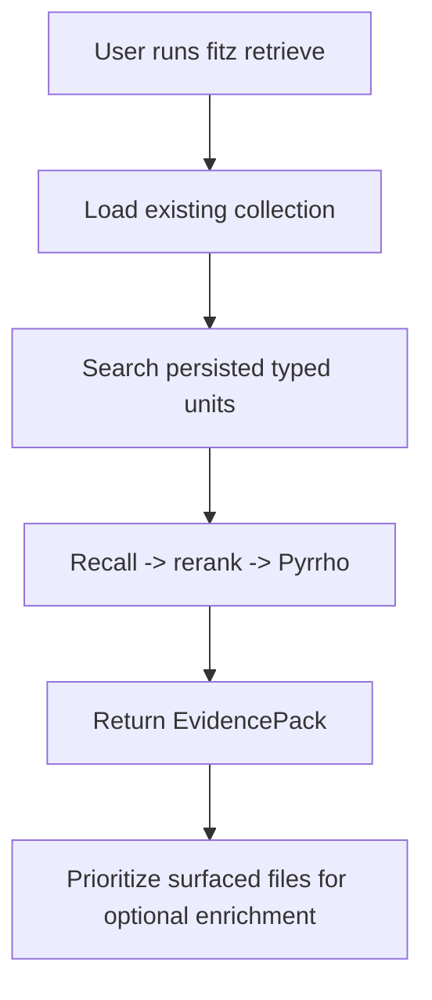

<!-- docs/QUERY_UX.md -->
# Query UX

The common journey is one command from the folder to search:

```bash
fitz retrieve "Which documents are relevant?"
```

`fitz retrieve` returns governed evidence, not a generated answer.

## First Run



There is one foreground guarantee: when source registration returns, supported
files are searchable or explicitly listed as failures. Qwen is not loaded on
that critical path.

## Repeat Query



When a source is pointed again, unchanged files keep their stored index and
enrichment state. Only changed files are reparsed.

## User-Facing Feed

| Message | Meaning |
|---|---|
| `Registering ...` | A source and collection were selected. |
| `Discovered N supported file(s).` | Scanning and hashing completed. |
| `Indexing N changed file(s)...` | Changed source is being parsed and stored. |
| `Searchable source index ready (N/N changed files).` | `point()` has reached its query-ready boundary. |
| `Analyzing query...` | Query profile and semantic keywords are being prepared. |
| `Retrieving relevant sources...` | Recall, reranking, evidence compilation, and Pyrrho are running. |
| `Enrichment pending: X/Y` | Source retrieval works while optional entity/hierarchy work remains. |

## Defaults

- source: current working directory
- collection: derived from the source folder name
- retrieval: broad recall, ONNX rerank, fixed evidence, Pyrrho
- enrichment: managed local Qwen entities/hierarchy, optional for query readiness
- answer synthesis: not used
