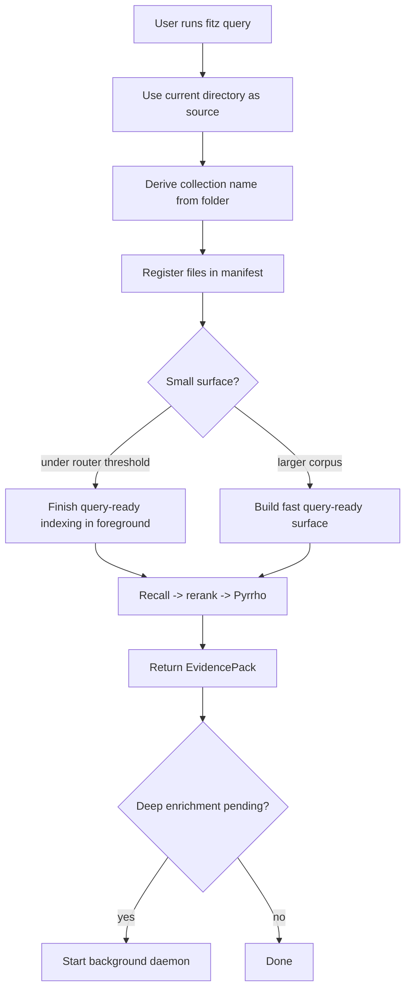
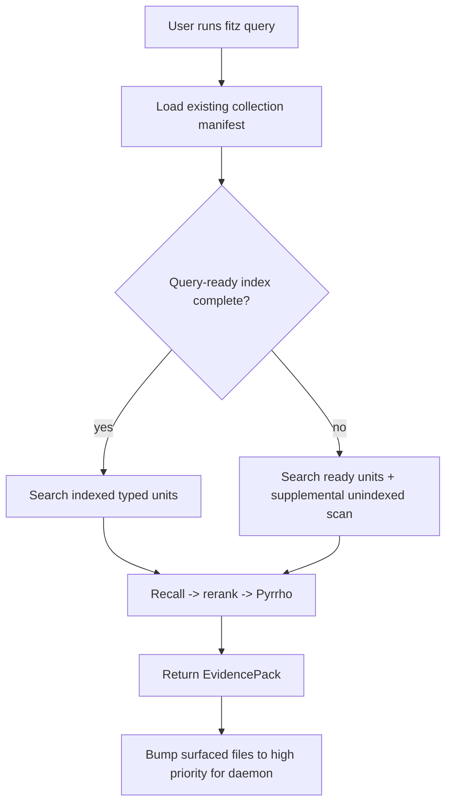

<!-- docs/QUERY_UX.md -->
# Query UX

The intended fitz-sage user journey is one command from the folder the user
wants to search:

```bash
fitz query "Which documents are relevant?"
```

`fitz query` returns governed evidence, not a generated answer. It should need no
flags for the common case.

## First Run



The first-run foreground work is limited to making retrieval usable. Required
deep enrichment continues after the evidence pack is returned.

## Repeat Query



Repeat queries should feel immediate once the collection has a query-ready
surface. If files are still registered but not query-ready, the supplemental
scan can still surface relevant files while the daemon catches up.

## User-Facing Feed

The CLI feed should say what is happening without exposing implementation
flags:

| Message | Meaning |
|---|---|
| `Registering ...` | fitz-sage found a source directory and collection target. |
| `Preparing managed Qwen3.5 0.8B ONNX enrichment model...` | Required local enrichment model is being downloaded or verified. |
| `Parsing documents...` | Foreground indexing is building the query-ready surface. |
| `Search surface ready; enrichment continues.` | Retrieval can run while deeper enrichment proceeds. |
| `Analyzing query...` | Query profile and semantic keywords are being prepared. |
| `Retrieving relevant sources...` | Recall, rerank, and Pyrrho cutoff are running. |
| `Indexing pending: X/Y` | Some files are not query-ready yet. |
| `Enrichment pending: X/Y` | Query-ready retrieval works, but deeper entity/hierarchy enrichment is still running. |

## Defaults

`fitz query` defaults:

- `source`: current working directory
- `collection`: derived from the source folder name
- retrieval: broad recall -> ONNX rerank -> Pyrrho cutoff
- enrichment: managed Qwen3.5 0.8B ONNX, required
- answer synthesis: not used

Users should reach for `fitz retrieve` only when they need advanced evidence
controls. Users should reach for `fitz answer` only when they explicitly want
optional synthesis after retrieval.
