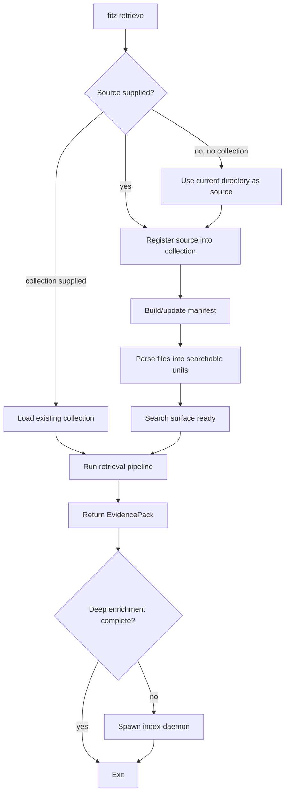
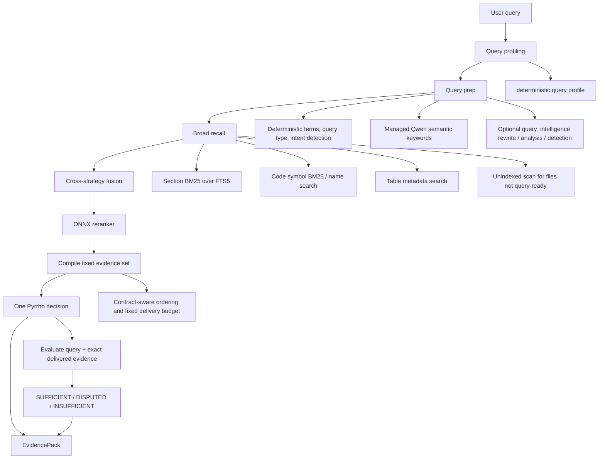
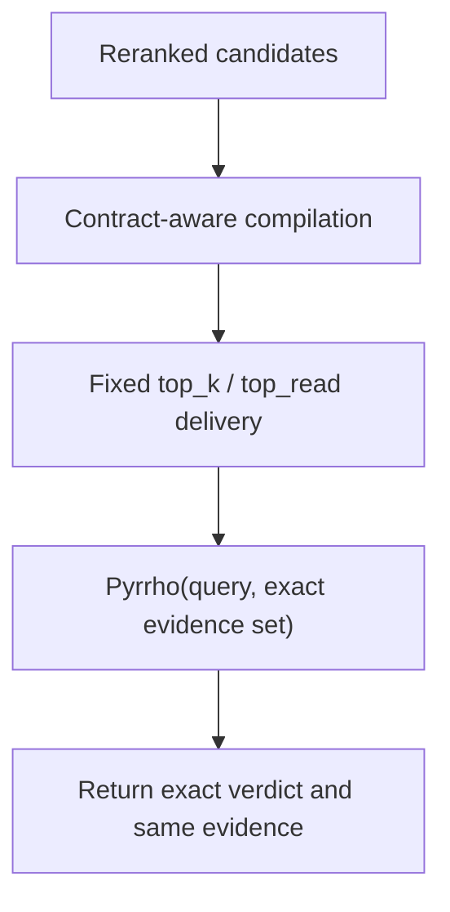
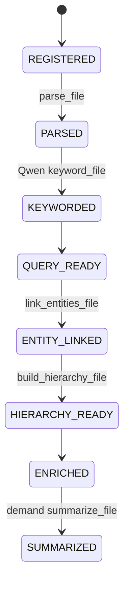

<!-- docs/RETRIEVAL_PIPELINE.md -->
# Retrieval Pipeline

fitz-sage is retrieval-first. The default product surface returns a governed
`EvidencePack`: ranked source units, Pyrrho metadata, indexing status, timings,
and enough provenance for another application to decide what to do next.
Generated answers are optional and live behind `fitz answer` / `fitz_sage.answer()`.

For the retrieval strategy itself, see
[Three-Stage Retrieval Strategy](features/retrieval/three-stage-strategy.md).
For the no-flags CLI journey, see [Query UX](QUERY_UX.md). For the returned
object shape, see [Evidence Pack](EVIDENCE_PACK.md).

---

## User Journey

The intended CLI journey is one command:

```bash
fitz retrieve "Which documents are relevant?"
```

When run from a document folder, this command:

1. Registers the current directory as the source.
2. Derives the collection name from the folder name.
3. Parses enough structure to make the corpus searchable.
4. Returns governed evidence.
5. Starts a detached indexing daemon when Qwen enrichment is still pending.

The same command exposes advanced evidence controls such as `--format json`
and `--top-k`.

---

## End-to-End Flow



The foreground command waits for the search surface, not for full enrichment.
That gives the user a fast first evidence pack while the daemon keeps building
the richer index in the background.

---

## Query Pipeline



### Stage 1: Broad Recall

Broad recall is intentionally permissive. It uses literal query terms,
managed Qwen semantic keywords, and intent fanout for
comparison, temporal, aggregation, and freshness queries. False positives are
acceptable because the reranker and fixed evidence delivery handle precision.
The configured accepted Pyrrho v2 package is evidence-conditioned. Query profiling comes
from deterministic signals, managed Qwen semantic keywords, and optional
query-intelligence providers.

Primary stores:

| Store | Retrieval unit | Search surface |
|-------|----------------|----------------|
| `SectionStore` | document sections and synthetic summaries | SQLite FTS5 + `bm25()` |
| `SymbolStore` | code symbols | name search + SQLite FTS5 + `bm25()` |
| `TableStore` / `SqliteTableStore` | table metadata and concrete row values | name/schema search plus row-value BM25 |
| Manifest scan | files not yet query-ready | path/heading/symbol BM25, optional file-selection LLM if configured |

### Stage 2: Rerank

The ONNX cross-encoder reranker scores `(query, candidate)` pairs after broad
recall. It is the precision stage. The default backend is
`Alibaba-NLP/gte-reranker-modernbert-base` through `onnxruntime`.

### Stage 3: Fixed Delivery And Pyrrho

Pyrrho does not answer the query or control retrieval. Fitz-Sage compiles one
fixed evidence set, sends the exact query and source text once, and maps the
returned verdict mechanically.



The default delivery contains at most the configured `top_read` evidence items,
or fewer when the caller requests a smaller `top_k`. Fitz-Sage does not retry
different prefixes or reinterpret Pyrrho's decision.

---

## Indexing State Machine



| State | User impact |
|-------|-------------|
| `REGISTERED` | File is known but not searchable yet. |
| `PARSED` | Raw content, symbols, sections, and tables are searchable. This is the foreground gate. |
| `QUERY_READY` | Managed Qwen keyword enrichment is complete for that file. |
| `ENTITY_LINKED` | Entity graph links are available. |
| `HIERARCHY_READY` | L1 hierarchy summaries are available. |
| `ENRICHED` | Required deep enrichment is complete. |
| `SUMMARIZED` | Demand summary exists because a query surfaced this file. |

`complete` in `indexing_status` means the query-ready keyword phase is done.
`fully_enriched` means entity/hierarchy enrichment is also done.

---

## Query Cases

### Case 1: No collection exists

`fitz retrieve "..."` registers the current directory, parses it, retrieves a
best-effort evidence pack, and starts the daemon if enrichment remains.

### Case 2: Source registered, search surface not ready

The CLI waits while parsing runs. It may show `Parsing documents... N/M`.
Retrieval starts once parsed units are searchable.

### Case 3: Search surface ready, enrichment still pending

Retrieval uses parsed sections, symbols, tables, and the unindexed scan for any
files not yet query-ready. The output may show `Indexing pending`,
`Enrichment pending`, or `Deep enrichment pending`. The daemon continues Qwen
keywords, entities, hierarchy, and demand summaries.

The supplemental scan only runs when the manifest still has files below
query-ready. Fully query-ready collections do not print scan progress or touch
disk fallback.

### Case 4: Index is complete

Retrieval uses the fully populated stores. No daemon is spawned, and later
queries should be faster because Qwen keyword/entity/hierarchy enrichment has
already run.

### Case 5: Optional answer synthesis

`fitz answer` runs the same retrieval pipeline, then sends governed context to
the configured synthesizer. This is separate from the retrieval package default.

---

## Strategy Roles

| Strategy | Role |
|----------|------|
| Sparse BM25 / keyword vocabulary | Broad recall backbone. |
| Managed Qwen semantic query keywords | Broad recall expansion in the default no-endpoint path. |
| Query rewriting | Optional `query_intelligence` enhancement for conversational context or ambiguous phrasing. |
| Multi-query decomposition | Optional `query_intelligence` enhancement for compound questions. |
| Comparison / temporal / aggregation / freshness detection | Deterministic default signals, optionally improved by query intelligence. |
| Entity graph | Context expansion after full enrichment. |
| Hierarchical summaries | Fully indexed recall for broad analytical questions. |
| Unindexed scan | Temporary bridge while files are not query-ready. |
| ONNX reranker | Precision stage before governance. |
| Pyrrho | Mandatory single sufficiency, dispute, or insufficiency decision over the fixed delivered evidence set. |
| Evidence closure | Deterministic bounded follow-up retrieval for unresolved query-contract obligations before compilation. |

Synthetic corpus summaries are not normal section hits. They are schema-versioned,
deleted before regeneration, excluded from ordinary BM25, and injected only when
the query contract/profile calls for a representative corpus overview.

---

## Model Responsibilities

| Model/runtime | Required? | Used for |
|---------------|-----------|----------|
| Managed Qwen3 0.6B ONNX GenAI | yes | ingestion keywords/entities/hierarchy and default semantic query keywords |
| ONNX reranker | default | candidate precision after broad recall |
| Reviewed local Pyrrho v2 package | required product governance | native evidence verdict, failure mode, retrieval intents, and evidence-kind metadata |
| OpenAI-compatible endpoint | optional | answer synthesis, optional query intelligence, optional vision parser |

No dense embedding model and no vector database are used.
