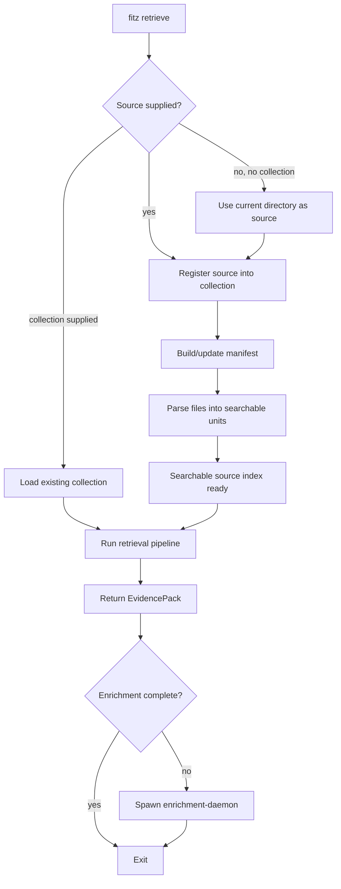
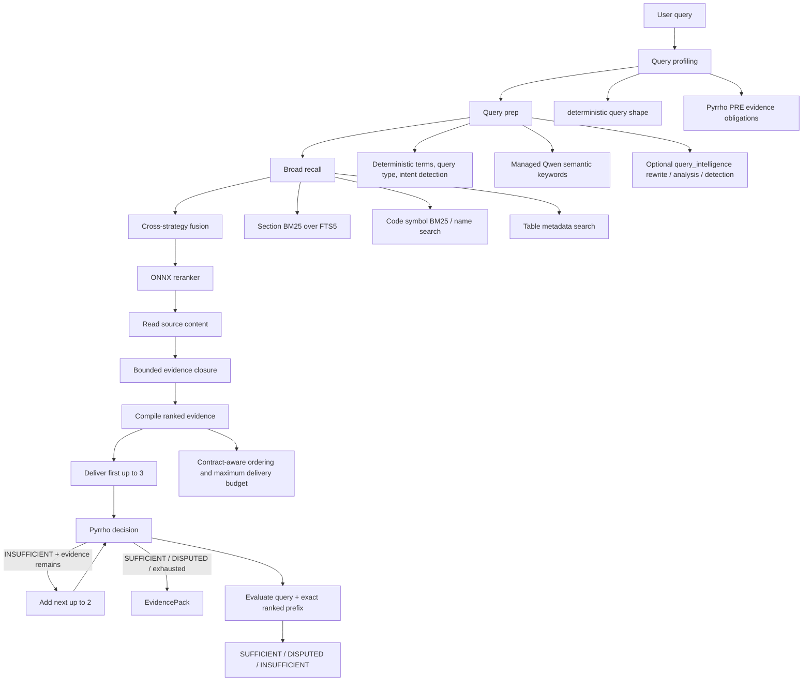
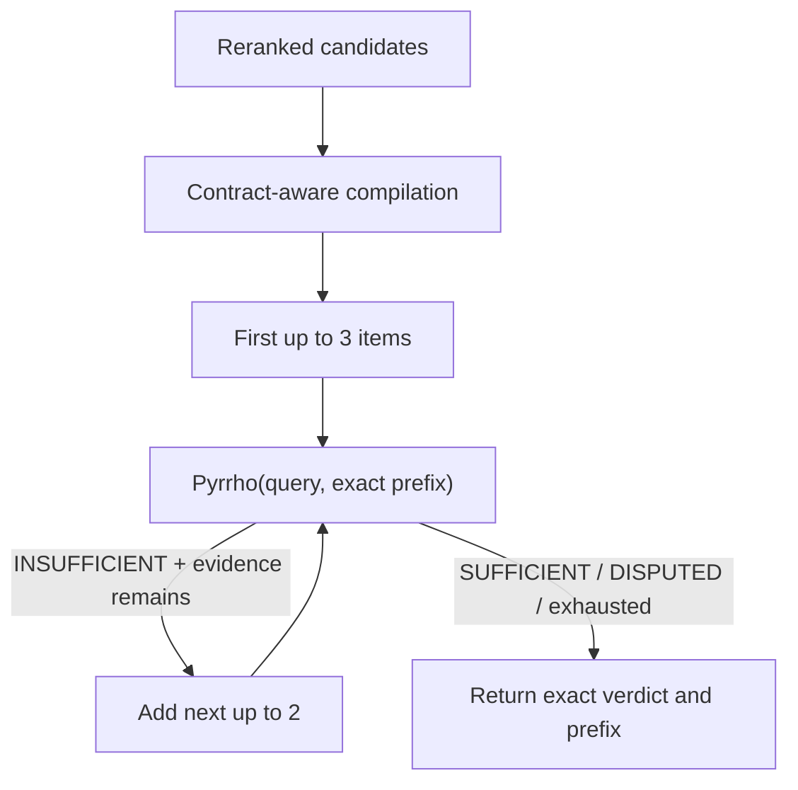
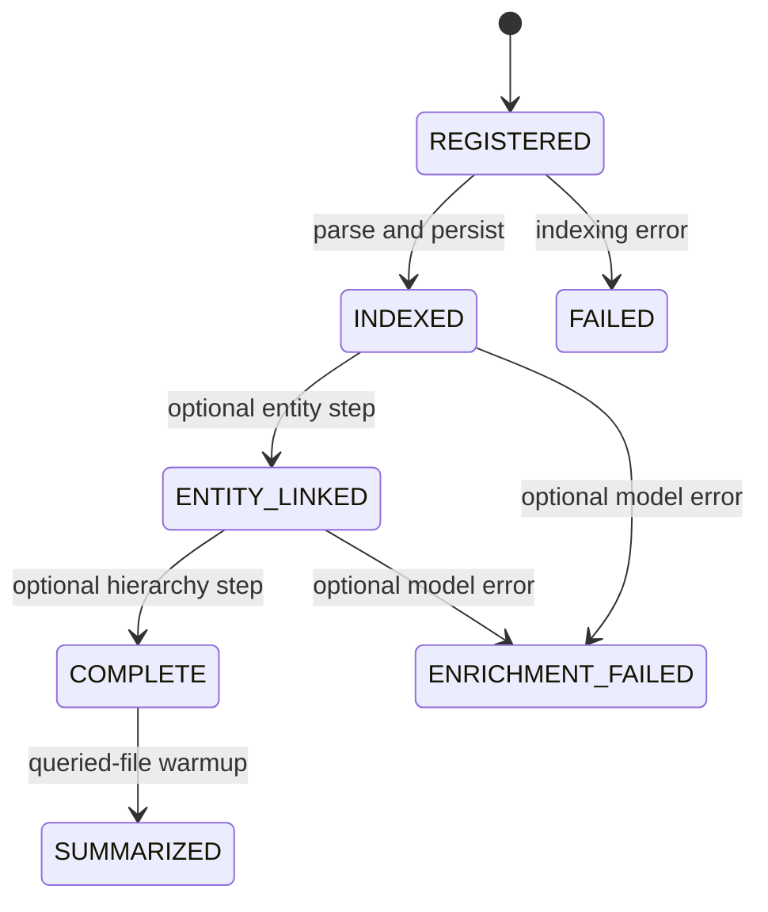

<!-- docs/RETRIEVAL_PIPELINE.md -->
# Retrieval Pipeline

fitz-sage is retrieval-first. The default product surface returns a governed
`EvidencePack`: ranked source units, Pyrrho metadata, indexing status, timings,
and enough provenance for another application to decide what to do next.
Generated answers are optional and live behind `fitz answer` / `fitz_sage.answer()`.

For the retrieval strategy itself, see
[Three-Stage Retrieval Strategy](features/retrieval/three-stage-strategy.md).
For the no-flags CLI journey, see [Query UX](QUERY_UX.md). For the returned
object shape, see [Evidence Pack](EVIDENCE_PACK.md).

---

## User Journey

The intended CLI journey is one command:

```bash
fitz retrieve "Which documents are relevant?"
```

When run from a document folder, this command:

1. Registers the current directory as the source.
2. Derives the collection name from the folder name.
3. Parses and persists all supported changed files.
4. Returns governed evidence.
5. Starts a detached enrichment daemon when optional work remains.

The same command exposes advanced evidence controls such as `--format json`
and `--top-k`.

---

## End-to-End Flow



`point()` completes the source index before retrieval starts. Entity and
hierarchy enrichment are separate and may continue after evidence is returned.

---

## Query Pipeline



### Stage 1: Broad Recall

Broad recall is intentionally permissive. It uses literal query terms,
managed Qwen semantic keywords, and intent fanout for
comparison, temporal, aggregation, and freshness queries. False positives are
acceptable because the reranker and evidence compilation handle precision.
Query profiling combines deterministic query shape, Pyrrho's query-only PRE
obligations, managed Qwen semantic keywords, and optional query-intelligence
providers.

Primary stores:

| Store | Retrieval unit | Search surface |
|-------|----------------|----------------|
| `SectionStore` | document sections and synthetic summaries | SQLite FTS5 + `bm25()` |
| `SymbolStore` | code symbols | name search + SQLite FTS5 + `bm25()` |
| `TableStore` / `SqliteTableStore` | table metadata and concrete row values | name/schema search plus row-value BM25 |

### Stage 2: Rerank

The ONNX cross-encoder reranker scores `(query, candidate)` pairs after broad
recall. It is the precision stage. The default backend is
`Alibaba-NLP/gte-reranker-modernbert-base` through `onnxruntime`. The
profile-aware scoring budget is separate from the full BM25 pool, which
remains available to evidence-contract rescue logic.

### Stage 3: Progressive Delivery And Pyrrho

Pyrrho does not answer the query. Its PRE heads can describe evidence
obligations before retrieval. After compilation, Fitz-Sage grows one ranked
prefix mechanically while Pyrrho owns every verdict.



The configured `top_read`, or a smaller caller `top_k`, caps delivery. Fitz-Sage
does not inspect probabilities or reinterpret a verdict: only exact
`INSUFFICIENT` continues the `3, 5, 7, ...` sequence.

---

## Index And Enrichment State



| State | User impact |
|-------|-------------|
| `REGISTERED` | File is known but not searchable yet. |
| `INDEXED` | Raw content, symbols, sections, and tables are searchable. |
| `FAILED` | Source indexing failed and the file is named in status. |
| `ENTITY_LINKED` | Entity graph links are available. |
| `COMPLETE` | Optional file entity/hierarchy enrichment is complete. |
| `SUMMARIZED` | Demand summary exists because a query surfaced this file. |
| `ENRICHMENT_FAILED` | Optional enrichment failed; source retrieval remains available. |

`indexing_status.complete` describes source-index success.
`indexing_status.enrichment.complete` describes independent optional work.

---

## Query Cases

### Case 1: No collection exists

`fitz retrieve "..."` registers the current directory, indexes it, retrieves an
evidence pack, and starts the enrichment daemon if optional work remains.

### Case 2: Source indexing is running

The CLI waits inside `point()`. Retrieval starts only after supported files are
indexed or explicitly failed.

### Case 3: Search surface ready, enrichment still pending

Retrieval uses the same persisted sections, symbols, and tables before and after
enrichment. The output may show `Enrichment pending`. The daemon continues
entities, hierarchy, and demand summaries.

### Case 4: Enrichment is complete

Retrieval may additionally use entity links and hierarchy summaries. No daemon
is spawned. The underlying source-index path is unchanged.

### Case 5: Optional answer synthesis

`fitz answer` runs the same retrieval pipeline, then sends governed context to
the configured synthesizer. This is separate from the retrieval package default.

---

## Strategy Roles

| Strategy | Role |
|----------|------|
| Sparse BM25 / literal source terms | Broad recall backbone. |
| Managed Qwen semantic query keywords | Broad recall expansion in the default no-endpoint path. |
| Query rewriting | Optional `query_intelligence` enhancement for conversational context or ambiguous phrasing. |
| Multi-query decomposition | Deterministic explicit-clause fanout; optional `query_intelligence` handles implicit or conversational compounds. |
| Comparison / temporal / aggregation / freshness detection | Deterministic default signals, optionally improved by query intelligence. |
| Entity graph | Context expansion when the relevant files have entity metadata. |
| Hierarchical summaries | Optional injected context for broad analytical questions. |
| ONNX reranker | Precision stage before governance. |
| Pyrrho | Authoritative sufficiency, dispute, or insufficiency decisions over progressively larger ranked prefixes. |
| Evidence closure | Deterministic bounded follow-up retrieval for unresolved query-contract obligations before compilation. |

Synthetic corpus summaries are not normal section hits. They are schema-versioned,
deleted before regeneration, excluded from ordinary BM25, and injected only when
the query contract/profile calls for a representative corpus overview.

---

## Model Responsibilities

| Model/runtime | Required? | Used for |
|---------------|-----------|----------|
| Managed Qwen3 0.6B ONNX GenAI | standard for query expansion; optional for background work | query semantic keywords, entities, and hierarchy |
| ONNX reranker | default | candidate precision after broad recall |
| Reviewed local Pyrrho v2 model | required product governance | native evidence verdict, failure mode, retrieval intents, and evidence-kind metadata |
| OpenAI-compatible endpoint | optional | answer synthesis, optional query intelligence, optional vision parser |

No dense embedding model and no vector database are used.
