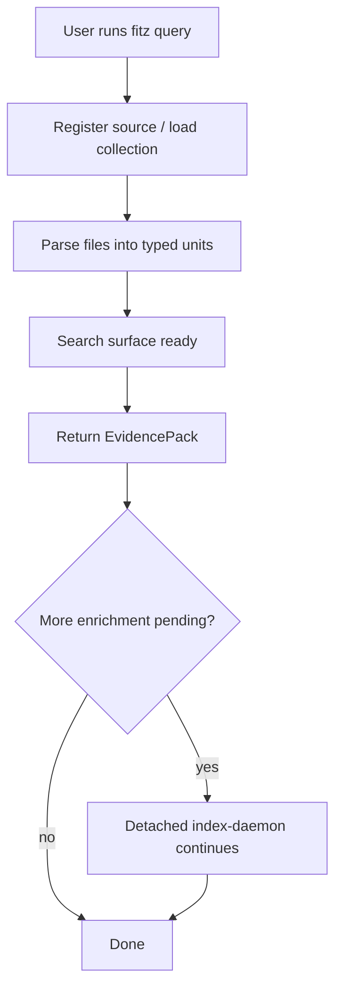
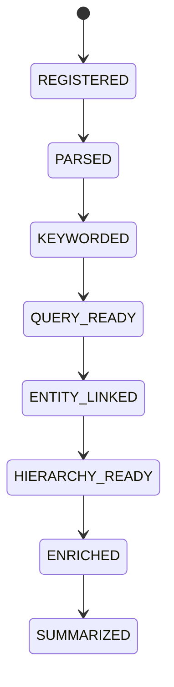

# Progressive KRAG

Progressive KRAG removes the separate ingest command. Users ask a question and
fitz-sage builds just enough index to return governed evidence, then keeps
improving the collection in the background.

```bash
fitz query "Which documents are relevant?"
fitz query "Which documents are relevant?" --source ./docs
```

`fitz query` defaults to the current directory when no `--source` or
`--collection` is supplied.

---

## Product Behavior



The first foreground command waits for parsing, not for full enrichment. That
means:

- code symbols, document sections, and tables are searchable quickly;
- managed Qwen keyword/entity/hierarchy work continues after the first result;
- the evidence table includes indexing status when work remains;
- later queries get better and faster as the collection converges.

---

## State Machine

| State | Meaning |
|-------|---------|
| `REGISTERED` | File is known in the manifest, no DB rows yet. |
| `PARSED` | Raw content and typed units are stored; foreground retrieval can run. |
| `KEYWORDED` | Managed Qwen has extracted keyword metadata. |
| `QUERY_READY` | Minimum Qwen enrichment is complete for the file. |
| `ENTITY_LINKED` | Entity graph links are populated. |
| `HIERARCHY_READY` | L1 hierarchy summaries exist. |
| `ENRICHED` | Required deep enrichment is complete. |
| `SUMMARIZED` | Demand summary exists because a query surfaced this file. |



`complete` in `indexing_status` means query-ready keywording is done.
`fully_enriched` means the deep entity/hierarchy phases are done.

---

## Components

### FileManifest

`progressive/manifest.py` tracks every source file, its content hash, state,
cheap structural hints, and priority. It persists under the local fitz
workspace collection directory.

### ManifestBuilder

`progressive/builder.py` scans files and extracts cheap hints without an LLM:

- Python symbols through `ast`
- TypeScript/JavaScript, Java, and Go symbols through tree-sitter when the
  grammar packages are installed
- Markdown/RST/text headings through lightweight extraction

### BackgroundIngestWorker

`progressive/worker.py` drives `KragIngestPipeline` through the state machine.
It pauses Qwen calls while a foreground query is active, then resumes after the
evidence pack is returned.

Priority is query-aware:

| Priority | Files |
|----------|-------|
| P1 | files surfaced by the latest query |
| P2 | sibling files in the same directory |
| P4 | remaining files by size |

### Unindexed Scan

`retrieval/strategies/agentic_search.py` bridges files that are not
query-ready yet. For small pending surfaces it uses path and BM25-style manifest
matching. For larger pending surfaces, it can use an optional fast chat provider
to select likely files, with BM25 prefiltering to keep prompts bounded. If no
chat provider exists, it falls back to BM25/path selection.

The scan returns normal `Address` objects, so results flow through the same
fusion, rerank, read, and governance path as indexed results.

---

## Why This Shape

**No separate ingest command.** A separate command forces users to understand
index lifecycle before they can ask their first question. `fitz query` is the
only required action.

**Parse first, enrich later.** Parsing is the cheapest broad action that unlocks
most of the corpus. Qwen enrichment is mandatory for the full index, but it does
not need to block the first evidence pack.

**Broad recall first.** Early retrieval is allowed to include false positives.
The ONNX reranker and Pyrrho cutoff decide which evidence is actually worth
showing.

**Synchronous core, background worker.** The engine is synchronous, so the
worker uses threads/events rather than an async runtime. Detached CLI indexing
uses `fitz index-daemon`, hidden from normal users.

---

## Files

| File | Purpose |
|------|---------|
| `fitz_sage/engines/fitz_krag/progressive/manifest.py` | manifest, states, indexing status |
| `fitz_sage/engines/fitz_krag/progressive/builder.py` | source scan and cheap structure extraction |
| `fitz_sage/engines/fitz_krag/progressive/worker.py` | staged background indexing |
| `fitz_sage/engines/fitz_krag/retrieval/strategies/agentic_search.py` | not-query-ready file bridge |
| `fitz_sage/cli/commands/retrieve.py` | `fitz query`/`fitz retrieve` foreground flow and daemon spawn |

---

## Related

- [Retrieval Pipeline](../../RETRIEVAL_PIPELINE.md)
- [Ingestion Pipeline](../../INGESTION.md)
- [Enrichment](../../ENRICHMENT.md)
