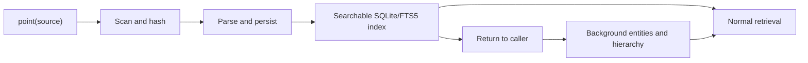

<!-- docs/features/platform/searchable-index-background-enrichment.md -->
# Searchable Index and Background Enrichment

Fitz-Sage separates durable source indexing from model-backed enrichment.

## Contract

`point(source)` returns after all supported changed files have reached one of
two explicit outcomes:

1. `INDEXED`: ordinary SQLite/FTS5 retrieval can search the file.
2. `FAILED`: the status inventory contains the parse/storage error.

Enrichment state does not create a third query path. There is no scan of raw
files as a fallback for an incomplete index.

## Why This Split Exists

Parsing and SQLite writes are fast and deterministic. Per-document generation
is comparatively expensive and can fail for reasons unrelated to source
availability. Coupling them made a 3-second model call define the indexing rate
even when the document had already been parsed.

The split gives the package:

- a measurable query-ready latency;
- one retrieval path before and after enrichment;
- indexing that does not require a managed model snapshot;
- explicit, independent source and enrichment failures;
- incremental re-pointing based on source hashes.

## Retrieval Before Enrichment

Literal source text, headings, symbol names, signatures, and table values are
already indexed. Sections without summaries provide a bounded source excerpt to
the ONNX reranker. Query-time semantic keywords can still expand the user's
query.

Entity graph edges and hierarchy summaries appear only after their enrichment
stages complete. Queries that depend on those optional signals may improve over
time, but raw source recall is never withheld while waiting for them.

## Operational Lifecycle

- The SDK and API return from `point()` only when source indexing settles.
- The CLI may continue optional work in `enrichment-daemon`.
- `indexing_status()` reports source and enrichment state separately.
- `continue_enrichment()` explicitly finishes persisted optional work.
- `wait_for_enrichment()` is never required before querying.

## Performance Gate

`benchmarks.fitz_bench.ingestion_benchmark` measures cold `point()` throughput
with `start_worker=False`. The default gate is 1 indexed file per second with no
source-index failures.

## Related

- [Ingestion Pipeline](../../INGESTION.md)
- [Background Enrichment](../../ENRICHMENT.md)
- [Retrieval Pipeline](../../RETRIEVAL_PIPELINE.md)
