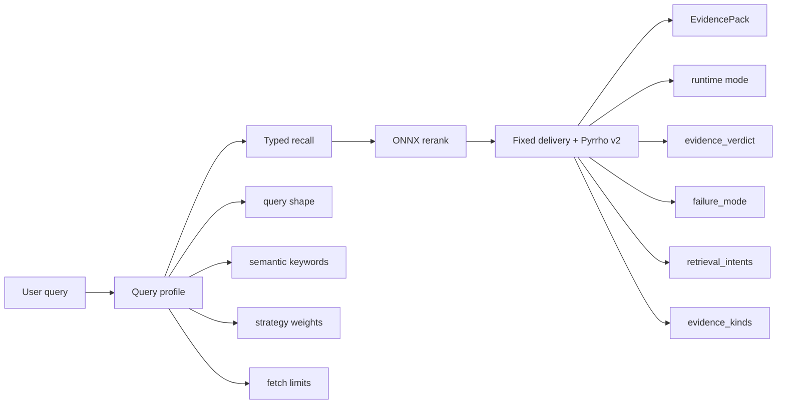

<!-- docs/features/retrieval/evidence-signals.md -->
# Evidence Signals

fitz-sage returns an `EvidencePack`: source evidence plus the metadata needed
to decide what to do with that evidence.

The important split is:

1. **Retrieval profile** - how Fitz searched before Pyrrho saw evidence.
2. **Governance signals** - how Pyrrho v2 judged the retrieved evidence.

Retrieval profile metadata explains search behavior. Governance metadata
explains sufficiency, dispute, or insufficiency.

---

## Lifecycle



---

## Retrieval Profile

Before retrieval, Fitz builds a query profile from deterministic query analysis,
managed Qwen query keywords, and optional query intelligence.

| Signal | Meaning | Retrieval effect |
|---|---|---|
| `analysis_type` | Primary surface such as general, code, documentation, data, or cross-surface. | Seeds strategy weights and entity targeting. |
| `keywords` | Managed Qwen and deterministic semantic query terms. | Improves lexical recall without embeddings. |
| `comparison_entities` | Entities or sides that must both appear for comparison questions. | Helps avoid one-sided evidence packs. |
| `temporal_references` | Dates, versions, quarters, or recency markers found in the query. | Boosts matching periods and freshness-sensitive evidence. |
| `strategy_weights` | Code, section, table, and chunk retrieval weights. | Points recall at the likely evidence surface. |
| `top_k` / `top_read` | Candidate and read limits. | Keeps narrow lookups fast and broad questions covered. |
| `required_modalities` | Evidence surfaces that should be present when known. | Ensures table, symbol, or section evidence remains eligible. |

The profile is stored in `EvidencePack.metadata.query_profile.profile`.
Its `has_*_intent` fields are Fitz-owned readings of the user's query.
Pyrrho PRE retrieval obligations are preserved separately under
`metadata.query_profile.pyrrho_pre` and in `retrieval_intents`; they can steer
evidence coverage without relabeling user intent.

Example:

```json
{
  "query_profile": {
    "profile": {
      "domain": "technical",
      "specificity": "moderate",
      "answer_type": "comparative",
      "top_k": 50,
      "top_read": 50,
      "keywords": ["rollback", "incident", "eu"],
      "comparison_entities": ["legacy guide", "implementation"],
      "has_comparison_intent": true,
      "has_temporal_intent": false,
      "strategy_weights": {
        "code": 0.6,
        "section": 0.25,
        "table": 0.15,
        "chunk": 0.35
      }
    }
  }
}
```

---

## Governance Signals

After recall, reranking, closure, and compilation, Fitz-Sage applies a fixed
evidence budget. Pyrrho v2 evaluates exactly that delivered set once.

| Signal | Meaning | Product use |
|---|---|---|
| `mode` | Runtime `AnswerMode`: `SUFFICIENT`, `DISPUTED`, or `INSUFFICIENT`. | Gate synthesis, UI display, automation, and review. |
| `probabilities` | Pyrrho probabilities for insufficient, disputed, sufficient. | Display confidence and audit the model decision. |
| `reason` / `reasons` | Human-readable explanation. | Tell users why Fitz judged evidence sufficient, disputed, or insufficient. |
| `evidence_delivery` | Available, selected, and limit counts fixed before Pyrrho. | Audit what evidence the model actually received. |
| `evidence_verdict` | Native v2 verdict: `SUFFICIENT`, `DISPUTED`, or `INSUFFICIENT`. | Inspect the model head behind the runtime mode. |
| `failure_mode` | Native v2 failure reason. | Explain insufficient or disputed evidence. |
| `retrieval_intents` | Native v2 multi-label intent metadata. | Decide whether another pass should focus on lookup, time, comparison, or coverage. |
| `evidence_kinds` | Native v2 multi-label evidence-surface metadata. | Decide whether text, table, code, config, logs, or layout evidence is missing. |

### Runtime AnswerMode

| Mode | Meaning | Product behavior |
|---|---|---|
| `SUFFICIENT` | Runtime API mode for a Pyrrho `SUFFICIENT` verdict. | Show evidence; optionally synthesize prose from it. |
| `DISPUTED` | Runtime API mode for a Pyrrho `DISPUTED` verdict. | Show conflicting sources and avoid one clean answer. |
| `INSUFFICIENT` | Runtime API mode for a Pyrrho `INSUFFICIENT` verdict. | Ask for more source material, clarify, or broaden retrieval. |

### Native V2 Heads

| Head | Labels | Meaning |
|---|---|---|
| `evidence_verdict` | `SUFFICIENT`, `DISPUTED`, `INSUFFICIENT` | The model's native evidence decision. |
| `failure_mode` | `none`, `unresolved_conflict`, `missing_or_incomplete_evidence`, `wrong_scope_or_version`, `ambiguous_request` | The most useful failure reason. |
| `retrieval_intents` | `needs_lookup`, `needs_temporal_resolution`, `needs_comparison_or_set`, `needs_broad_coverage` | What the evidence task appears to require. |
| `evidence_kinds` | `needs_text`, `needs_table_or_record`, `needs_code_or_symbol`, `needs_config_or_setting`, `needs_log_or_run_result`, `needs_document_layout` | What evidence surface matters. |

---

## Examples

### Exact Lookup

Query:

> "Where is Pyrrho governance implemented?"

Expected retrieval behavior:

- exact symbol and identifier recall should dominate
- code evidence should stay eligible
- a small fixed evidence budget is usually enough for this lookup

Likely governance metadata:

| Signal | Likely value |
|---|---|
| `evidence_verdict` | `SUFFICIENT` |
| `mode` | Runtime `SUFFICIENT` |
| `failure_mode` | `none` |
| `retrieval_intents` | `needs_lookup` |
| `evidence_kinds` | `needs_code_or_symbol` |

### Comparison Query

Query:

> "Compare `query_profile_metadata` and `_format_query_profile` responsibilities."

Expected retrieval behavior:

- both comparison sides should be present
- retrieval should deliver both sides before Pyrrho evaluates the evidence
- code and prose evidence may both matter

Likely governance metadata when complete:

| Signal | Likely value |
|---|---|
| `evidence_verdict` | `SUFFICIENT` |
| `mode` | Runtime `SUFFICIENT` |
| `retrieval_intents` | `needs_comparison_or_set` |
| `evidence_kinds` | `needs_code_or_symbol`, `needs_text` |

### Temporal Query

Query:

> "What changed in March 2024?"

Expected retrieval behavior:

- evidence should match the requested timeframe
- wrong-month evidence should be marked insufficient
- versioned or dated sources should be preferred

Likely governance metadata when evidence is incomplete:

| Signal | Likely value |
|---|---|
| `evidence_verdict` | `INSUFFICIENT` |
| `mode` | Runtime `INSUFFICIENT` |
| `failure_mode` | `wrong_scope_or_version` |
| `retrieval_intents` | `needs_temporal_resolution` |

### Missing Evidence

Query:

> "What was Q4 revenue?"

If the corpus only has Q1-Q3 evidence, the pack should not certify an answer.

Useful governance metadata:

| Signal | Meaning |
|---|---|
| `evidence_verdict = INSUFFICIENT` | Native v2 verdict agrees the evidence cannot answer. |
| `mode = INSUFFICIENT` | Runtime API mode for insufficient evidence. |
| `failure_mode = missing_or_incomplete_evidence` | The corpus lacks the required Q4 evidence. |
| `retrieval_intents = needs_temporal_resolution` | Another pass should focus on the missing period. |

### Conflict

Query:

> "What is the current refund window?"

If two policies disagree, the pack can return `DISPUTED`.

Useful governance metadata:

| Signal | Meaning |
|---|---|
| `mode = DISPUTED` | Evidence conflicts. |
| `evidence_verdict = DISPUTED` | Native v2 verdict identifies conflict. |
| `failure_mode = unresolved_conflict` | The conflict still needs authority or scope resolution. |
| `evidence_kinds` | Shows which evidence surfaces contributed to the conflict. |

---

## Integration Patterns

| Pattern | Use these signals |
|---|---|
| Show evidence directly | source evidence, `mode`, `reasons` |
| Generate prose only when safe | `mode`, `probabilities`, `evidence_verdict` |
| Ask for more documents | `mode`, `failure_mode`, `retrieval_intents`, `evidence_kinds` |
| Run a focused retry | `retrieval_intents`, `evidence_kinds`, retrieval trace, compiler roles |
| Explain disputes | `mode`, `failure_mode`, source evidence |
| Build audit logs | fixed delivered evidence, content hashes, exact Pyrrho input/output, runtime fingerprints |
| Tune retrieval quality | `query_profile`, `retrieval_trace`, `evidence_delivery` |

The core rule:

> Retrieval profile metadata tells you what Fitz searched for. Pyrrho v2
> metadata tells you whether the retrieved evidence is good enough to use.
