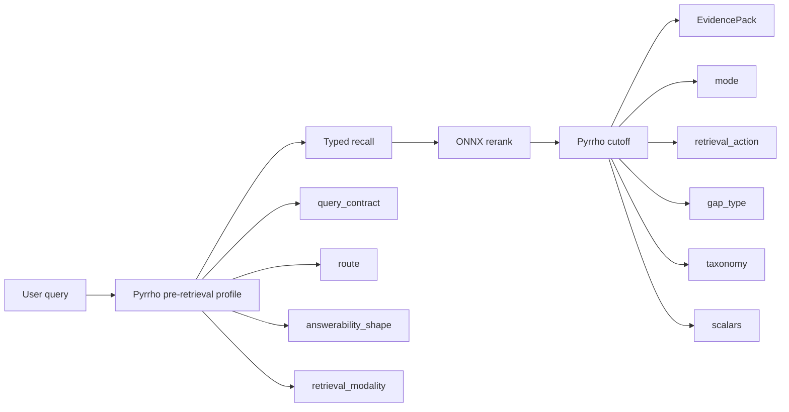

<!-- docs/features/retrieval/evidence-signals.md -->
# Pre-Retrieval and Post-Retrieval Evidence Signals

fitz-sage returns an `EvidencePack`: source evidence plus the signals needed to
decide what to do with that evidence.

The important split is:

1. **Pre-retrieval signals** describe the query before search starts.
2. **Post-retrieval signals** judge the evidence after search and reranking.

Pre-retrieval is about planning. Post-retrieval is about trust.

---

## Lifecycle

The pre-retrieval profile changes how Fitz searches. The post-retrieval cutoff
changes what the caller should do next.

---

## Pre-Retrieval Signals

Before retrieval, Pyrrho reads the query alone. These signals shape the first
retrieval pass.

| Signal | Meaning | Retrieval effect |
|---|---|---|
| `query_contract` | The evidence contract the query requires. | Sets the query shape and cutoff policy. |
| `route` | The broad domain of the query. | Tunes domain defaults for technical, legal, medical, financial, or general questions. |
| `answerability_shape` | The expected answer form. | Adjusts breadth, answer type, `top_k`, and `top_read`. |
| `retrieval_modality` | The source surface likely to matter. | Reweights code, table, section, chunk, config, log, PDF-layout, or mixed retrieval. |

### `query_contract`

`query_contract` is the most important pre-retrieval signal. It tells Fitz what
kind of evidence must be present before a result can be trusted.

| Label | Meaning | Example |
|---|---|---|
| `structured_lookup` | The query asks for a specific identifier, function, table, section, entity, or record. | "Where is `classify_query` implemented?" |
| `comparison_coverage` | The query needs coverage for multiple sides. | "Compare React and Vue performance." |
| `temporal_grounding` | The query needs evidence anchored to a time period. | "What changed in March 2024?" |
| `exhaustive_coverage` | The query asks for all items, a count, or complete enumeration. | "List every failed test case." |
| `representative_overview` | The query is broad and needs representative sources, not a narrow answer. | "What are the main themes in this corpus?" |
| `evidence_sufficiency` | Ordinary evidence sufficiency. | "What is the refund policy?" |

### `route`

`route` identifies the query domain. Fitz uses it as an advisory signal for
retrieval defaults and metadata.

Typical labels include:

- `technology_computing`
- `law_policy`
- `science_medicine`
- `economics_finance`
- `history_geography`
- `culture_society`
- `general_commonsense`

### `answerability_shape`

`answerability_shape` describes the expected output form.

| Label | Meaning | Retrieval behavior |
|---|---|---|
| `direct_answer` | One or a few sources should directly answer the query. | Keeps retrieval narrower. |
| `synthesis_answer` | Several sources may need to be combined. | Reads broader evidence. |
| `set_answer` | The user expects a list, count, or set of items. | Broadens recall and treats coverage as important. |
| `structured_reasoning` | The answer requires comparison, steps, or structured evidence. | Gives the cutoff more room before stopping. |

### `retrieval_modality`

`retrieval_modality` predicts where the answer likely lives.

| Label | Meaning | Retrieval behavior |
|---|---|---|
| `unstructured_text` | Prose sections are likely most useful. | Weights section/chunk retrieval. |
| `structured_table` | Table data or CSV rows are likely most useful. | Weights table retrieval. |
| `code` | Code symbols or source files are likely most useful. | Weights symbol/code retrieval. |
| `configuration` | Config files, settings, or manifests are likely useful. | Keeps exact file and identifier recall important. |
| `log_trace` | Logs, traces, or error records are likely useful. | Favors exact tokens, errors, and trace-like units. |
| `pdf_layout` | PDF page structure or layout may matter. | Favors document sections and layout-aware parsing. |
| `mixed` | More than one source surface is likely needed. | Keeps strategy weights balanced. |

---

## Post-Retrieval Signals

After recall and reranking, Pyrrho evaluates evidence prefixes: top 1, top 2,
top 3, and so on. The cutoff stops when the evidence is sufficient, disputed,
or exhausted.

| Signal | Meaning | Product use |
|---|---|---|
| `mode` | Final trust verdict. | Decide whether to answer, show evidence, abstain, or trigger review. |
| `reasons` | Human-readable explanation. | Display why Fitz trusted, disputed, or abstained. |
| `stop_reason` | Why cutoff stopped. | Route next action: answer, retry, broaden, clarify, or request docs. |
| `retrieval_action` | Pyrrho's recommended evidence action. | Drive second-pass retrieval or agent behavior. |
| `gap_type` | What is missing, conflicting, or unsafe. | Tell the user what evidence is needed. |
| `taxonomy` | Relationship between evidence and query. | Build displays for authority, conflict, agreement, and coverage. |
| `scalars` | Continuous quality and risk scores. | Monitor quality, trigger review, or tune retry thresholds. |

### `mode`

| Label | Meaning | Recommended product behavior |
|---|---|---|
| `TRUSTWORTHY` | The selected evidence supports a confident answer. | Show evidence; optionally synthesize prose from it. |
| `DISPUTED` | The selected evidence contains meaningful conflict. | Show conflicting sources and avoid a single clean answer. |
| `ABSTAIN` | The selected evidence is missing, incomplete, or unsafe. | Ask for more source material, clarify, or broaden retrieval. |

### `retrieval_action`

`retrieval_action` is Pyrrho's evidence-stage recommendation.

| Label | Meaning | Product behavior |
|---|---|---|
| `answer_now` | The current evidence is enough. | Return the pack or synthesize from selected evidence. |
| `retrieve_more` | More of the same kind of evidence may help. | Run a broader read/candidate pass. |
| `broaden_search` | The current retrieval frame is too narrow. | Increase breadth and relax the retrieval profile. |
| `resolve_conflict` | Evidence conflicts need more resolving context. | Fetch more sources around the conflicting units. |
| `ask_clarifying_question` | The query itself is ambiguous. | Ask the user to narrow entity, timeframe, scope, or source type. |
| `structured_lookup` | Exact lookup behavior should dominate. | Prioritize exact identifiers, symbols, records, or sections. |

### `gap_type`

`gap_type` names the evidence failure when the pack is incomplete or unsafe.

Common labels include:

- `missing_specific_fact`
- `missing_timeframe`
- `missing_comparison_side`
- `missing_source_authority`
- `conflicting_values`
- `wrong_entity`
- `wrong_version_or_scope`
- `too_broad`
- `incomplete_enumeration`
- `unsupported_inference`
- `ambiguous_query`

### `taxonomy`

`taxonomy` describes the evidence relationship. It is useful for richer
interfaces that distinguish a direct answer from conflict, partial overlap,
wrong-entity evidence, or a single authoritative source.

Examples:

| Label | Meaning |
|---|---|
| `direct_answer` | Evidence directly answers the query. |
| `single_authoritative` | One source is authoritative enough for the query. |
| `consistent_chain` | Multiple sources support a coherent answer. |
| `factual_contradiction` | Sources disagree on a factual claim. |
| `scope_conflict` | Sources answer different scopes. |
| `temporal_mismatch` | Evidence uses the wrong timeframe. |
| `wrong_entity` | Evidence is about the wrong entity. |
| `too_general` | Evidence is relevant but too broad. |

### `scalars`

`scalars` are continuous signals for ranking, monitoring, and policy decisions.

| Scalar | Meaning |
|---|---|
| `evidence_sufficiency` | How sufficient the evidence looks overall. |
| `query_evidence_alignment` | How well the evidence matches the query. |
| `answer_coverage` | How much of the requested answer shape is covered. |
| `conflict_density` | How conflict-heavy the evidence appears. |
| `retrieval_retry_value` | How useful another retrieval pass is likely to be. |
| `false_trustworthy_risk` | Estimated risk of trusting weak evidence. |
| `evidence_failure_severity` | Severity of evidence failure when the pack is incomplete or unsafe. |

---

## Examples

### Exact Lookup

Query:

> "Where is `classify_query` implemented?"

Typical pre-retrieval signals:

| Signal | Likely value |
|---|---|
| `query_contract` | `structured_lookup` |
| `retrieval_modality` | `code` |
| `answerability_shape` | `direct_answer` |

Expected post-retrieval result:

| Signal | Likely value |
|---|---|
| `mode` | `TRUSTWORTHY` |
| `stop_reason` | `structured_lookup_exact_match` |
| `retrieval_action` | `answer_now` |

Product behavior: show the exact code symbol and source path.

### Comparison Query

Query:

> "Compare `query_profile_metadata` and `_format_query_profile` responsibilities."

Typical pre-retrieval signals:

| Signal | Likely value |
|---|---|
| `query_contract` | `comparison_coverage` |
| `answerability_shape` | `structured_reasoning` |
| `retrieval_modality` | `code` or `mixed` |

Expected post-retrieval behavior:

- both comparison sides must be present
- one-side evidence should not pass cutoff
- `gap_type` can identify `missing_comparison_side`

Product behavior: show both sources, or explain which side is missing.

### Temporal Query

Query:

> "What changed in March 2024?"

Typical pre-retrieval signals:

| Signal | Likely value |
|---|---|
| `query_contract` | `temporal_grounding` |
| `answerability_shape` | `synthesis_answer` |

Expected post-retrieval behavior:

- evidence must contain the requested timeframe
- wrong-month evidence should abstain
- `gap_type` can identify `missing_timeframe`

Product behavior: show time-grounded evidence or ask for documents covering the
requested period.

### Missing Evidence

Query:

> "What was Q4 revenue?"

If the corpus only has Q1-Q3 evidence, the pack should not certify an answer.

Useful post-retrieval signals:

| Signal | Meaning |
|---|---|
| `mode = ABSTAIN` | Evidence is insufficient. |
| `gap_type = missing_timeframe` or `missing_specific_fact` | The corpus lacks the required Q4 revenue evidence. |
| `retrieval_action = retrieve_more` or `ask_clarifying_question` | Another retrieval pass or user clarification may help. |

Product behavior: show related evidence and ask for Q4 source documents.

### Conflict

Query:

> "What is the current refund window?"

If two policies disagree, the pack can return `DISPUTED`.

Useful post-retrieval signals:

| Signal | Meaning |
|---|---|
| `mode = DISPUTED` | Evidence conflicts. |
| `taxonomy = factual_contradiction` or `scope_conflict` | The conflict type. |
| `retrieval_action = resolve_conflict` | More context may resolve authority or scope. |

Product behavior: show both sources and avoid presenting one clean answer.

---

## Integration Patterns

| Pattern | Use these signals |
|---|---|
| Show evidence directly | source evidence, `mode`, `reasons` |
| Generate prose only when safe | `mode`, `false_trustworthy_risk`, `answer_coverage` |
| Ask for more documents | `mode`, `gap_type`, `evidence_failure_severity` |
| Run an automatic retry | `retrieval_action`, `retrieval_retry_value`, `retrieval_modality` |
| Explain disputes | `mode`, `taxonomy`, `conflict_density`, source evidence |
| Build audit logs | source evidence, `stop_reason`, `trajectory`, `scalars` |
| Tune retrieval quality | `query_contract`, `retrieval_modality`, `stop_reason`, `scalars` |

The core rule:

> Pre-retrieval signals tell you what Fitz searched for. Post-retrieval signals
> tell you whether the retrieved evidence is good enough to use.
