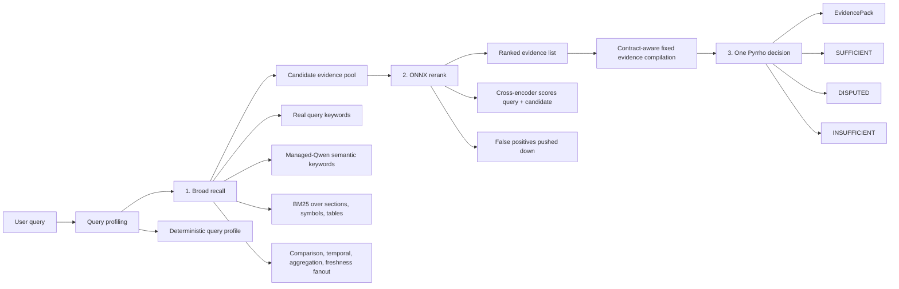
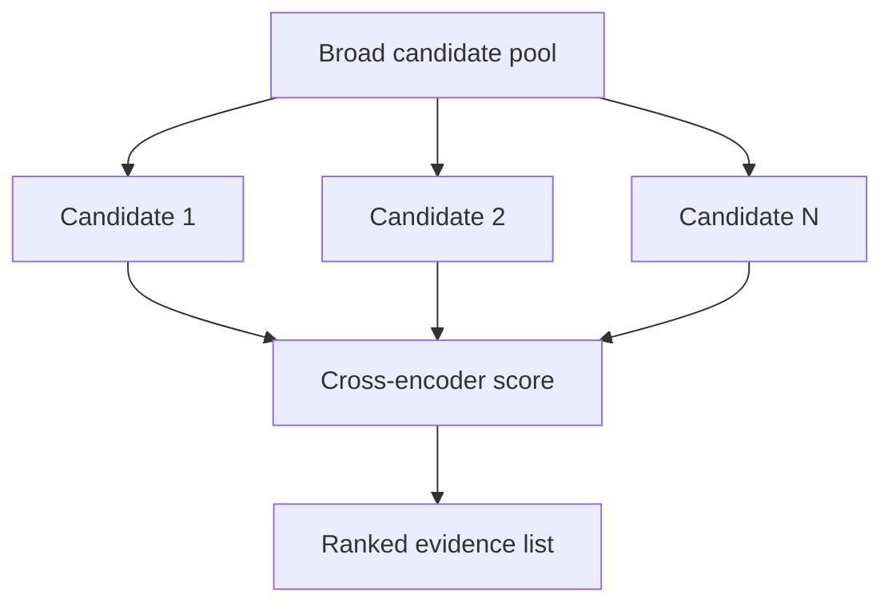
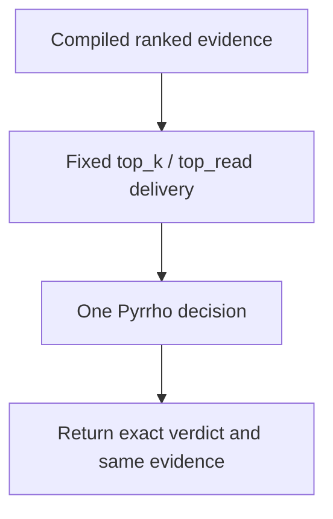

<!-- docs/features/retrieval/three-stage-strategy.md -->
# Three-Stage Retrieval Strategy

fitz-sage is a retrieval package first. The default product path does not
generate an answer. It returns a governed `EvidencePack`: ranked source units,
provenance, Pyrrho metadata, and indexing status.

The retrieval strategy is deliberately split into three jobs:

1. **Recall** — find a broad candidate set.
2. **Rerank** — impose relevance order on that candidate set.
3. **Pyrrho** — judge one fixed delivered evidence set.

This split matters because each stage optimizes a different failure mode. Recall
is allowed to be noisy. Reranking is where precision belongs. Pyrrho decides
whether the ranked evidence is sufficient, disputed, or incomplete. The default
Pyrrho v2 owns query-planning heads before retrieval and evidence governance
after retrieval. Fitz/KRAG owns the retrieval mechanics that consume those
signals.

---

## Pipeline

The core rule is simple:

> Recall should be broad enough to avoid missing important documents. Precision
> should be imposed after recall. Sufficiency should be judged after ranking.

---

## Stage 1: Broad Recall

Broad recall builds the candidate pool. It is intentionally permissive and cheap.
False positives are acceptable because later stages rank and compile.

Inputs:

- the user's literal query terms
- managed Qwen semantic keywords for the query
- deterministic query shape: narrow, broad, comparison, temporal, aggregation, or freshness-sensitive
- typed retrieval units from KRAG: sections, code symbols, tables, files, summaries

Main retrieval legs:

| Leg | Purpose |
|---|---|
| SQLite FTS5 + `bm25()` | Default text recall over sections and summaries. |
| Symbol/name search | Exact recall for functions, classes, methods, identifiers, error codes, and test IDs. |
| Table metadata search | Recall over table names, schemas, columns, and row counts. |
| Semantic keywords | Adds managed-Qwen recall suggestions. |
| Intent fanout | Adds side queries for comparison, temporal, aggregation, and freshness cases. |
| Supplemental scan | Reads files that are registered but not fully query-ready yet. |

Broad recall does not need deep intelligence. It needs coverage. The minimum
useful quick path is:

1. extract real query keywords
2. add managed-Qwen semantic keywords
3. run BM25 over typed units

Fully indexed retrieval adds more surfaces:

- L1/hierarchy summaries for broad corpus questions
- entity graph links for related-document expansion
- demand summaries for files repeatedly surfaced by queries
- richer keyword/entity metadata from required enrichment

---

## Stage 2: ONNX Rerank

The recall pool is intentionally noisy. The reranker is the precision stage.

The default reranker is an INT8 ONNX cross-encoder. It scores each
`(query, candidate)` pair directly, then reorders candidates by relevance.

This is why broad recall can tolerate false positives. A candidate only needs to
enter the pool. It does not need to be perfect at rank 1. The reranker promotes
the candidates that actually answer the query and pushes broad keyword matches
down.

Reranking also standardizes the candidate list before Pyrrho sees it. Pyrrho
should judge evidence sufficiency over a relevance-ordered set, not over raw
BM25 order.

For comparison-shaped metric queries, evidence compilation can promote
evidence that directly contains the requested metric or table row ahead of
weaker prose mentions before
fixed delivery. This keeps questions like "Q1 vs Q2 total responses" from
delivering only a generic Q1 summary when the exact metric table is available.

---

## Stage 3: Fixed Delivery And Pyrrho

Pyrrho is not an answer generator and does not retrieve more documents. It is a
local CPU governance classifier over `(query, delivered evidence set)`.

For a ranked list, Fitz-Sage fixes the delivery budget before Pyrrho runs:

Pyrrho answers this governance question:

> Given the user query and the delivered evidence items, have we gathered
> enough evidence for a downstream system to answer?

Verdicts:

| Verdict | Meaning for retrieval |
|---|---|
| `SUFFICIENT` | The evidence set is sufficient and internally consistent. |
| `DISPUTED` | The evidence set contains a meaningful conflict. |
| `INSUFFICIENT` | The evidence set is incomplete or does not answer the query. |

Query shape affects retrieval and compilation before delivery:

| Query shape | Retrieval behavior |
|---|---|
| Narrow lookup | Uses a tighter evidence budget. |
| Broad corpus overview | Retrieves and compiles a wider representative set. |
| Comparison | Seeks evidence representing both sides. |
| Aggregation | Uses broader recall because completeness matters. |

No query shape can delay, replace, or bypass Pyrrho's verdict.

---

## How Retrieval Features Fit

The product model is one pipeline with specialized tactics inside the right
stage.

| Feature | Stage | Role |
|---|---|---|
| Sparse BM25 / FTS5 | Recall | Cheap candidate generation. |
| Keyword vocabulary | Recall | Exact identifiers, codes, acronyms, test IDs. |
| Managed Qwen semantic keywords | Recall | Adds related recall terms without embeddings. |
| Query rewriting | Recall | Fixes conversational or ambiguous phrasing before search. |
| Multi-query decomposition | Recall | Bounded fanout for compound questions. |
| Comparison detection | Recall | Ensures both compared entities enter the pool. |
| Temporal detection | Recall | Adds period-aware terms and boosts matching periods. |
| Aggregation detection | Recall | Increases breadth when lists/completeness matter. |
| Freshness scoring | Recall / fusion | Boosts recent sources when the query asks for current status. |
| Hierarchical summaries | Recall | Helps broad questions after full enrichment. |
| Entity graph | Recall / expansion | Adds related evidence once entity enrichment exists. |
| Supplemental scan | Recall | Covers registered files that are not fully query-ready yet. |
| ONNX reranker | Rerank | Sorts noisy recall candidates by relevance. |
| Metric comparison compilation | Compile | Promotes direct metric/table evidence before fixed delivery. |
| Evidence closure | Recall / expansion | Runs bounded contract-driven bridge retrieval before compilation; it does not react to Pyrrho. |
| Pyrrho | Governance | Decides enough / disputed / not enough over the delivered evidence set. |

Nothing in this model makes enrichment optional. Required enrichment improves
the recall surface and the evidence available to the reranker. The difference is
that the foreground query can return once the search surface is usable, while
the background daemon continues deeper enrichment.

---

## Why This Beats Flat Vector Retrieval

Flat vector retrieval tries to do recall and ranking in one step. That creates
avoidable failures:

- exact identifiers get blurred by semantic similarity
- comparison queries retrieve one side but miss the other
- broad queries over-rank random matching source units
- missing evidence still looks answerable to a generator
- conflicting evidence is treated as just another context pack

fitz-sage separates those concerns:

1. **Recall** accepts broad candidates and false positives.
2. **Rerank** makes the broad list useful.
3. **Pyrrho** decides whether the useful list is enough.

The output is not "an answer with citations." The output is governed evidence
that another application can trust, inspect, or pass into optional synthesis.

---

## Implementation Map

| Responsibility | Main files |
|---|---|
| CLI evidence path | `fitz_sage/cli/commands/retrieve.py` |
| Engine evidence contract | `fitz_sage/engines/fitz_krag/engine.py` |
| Query planning/profile | `fitz_sage/engines/fitz_krag/query_planner.py`, `fitz_sage/engines/fitz_krag/retrieval_profile.py` |
| Broad recall router | `fitz_sage/engines/fitz_krag/retrieval/router.py` |
| Section/code/table strategies | `fitz_sage/engines/fitz_krag/retrieval/strategies/` |
| Reranker | `fitz_sage/engines/fitz_krag/retrieval/reranker.py`, `fitz_sage/llm/providers/onnx_reranker.py` |
| Pyrrho | independent `pyrrho` runtime via `fitz_sage/integrations/pyrrho.py` |
| Progressive indexing | `fitz_sage/engines/fitz_krag/progressive/` |
| Enrichment | `fitz_sage/engines/fitz_krag/ingestion/enricher.py`, `fitz_sage/llm/providers/onnx_chat.py` |

See also:

- [Retrieval Pipeline](../../RETRIEVAL_PIPELINE.md) for the end-to-end CLI and indexing flow.
- [Query UX](../../QUERY_UX.md) for the one-command user journey.
- [Evidence Pack](../../EVIDENCE_PACK.md) for the returned object contract.
- [Managed Models](../../MANAGED_MODELS.md) for Qwen, reranker, and Pyrrho downloads.
- [Reranking](reranking.md) for the ONNX cross-encoder details.
- [Epistemic Honesty](../governance/epistemic-honesty.md) for Pyrrho governance.
- [Sparse Search](sparse-search.md) for the BM25 recall layer.
