<!-- docs/roadmap/retrieval-pipeline-full-picture.md -->
# fitz-sage Retrieval Pipeline: Full Picture

Status: research synthesis and product direction
Date: 2026-06-02
Scope: retrieval-only fitz-sage, managed Qwen3.5 0.8B ONNX enrichment, instant best-effort query UX

## 1. Product Contract

fitz-sage is a retrieval package, not an answer-generation product.

The primary user experience should be:

```powershell
fitz query "which documents are relevant?"
```

The command should return ranked source documents or source units with provenance.
It should not generate a natural-language answer by default.

The product promise is:

- one command for normal use,
- minimal flags,
- fast first evidence,
- background indexing and enrichment,
- no external inference server requirement,
- managed local Qwen3.5 0.8B ONNX as the required enrichment model,
- mandatory Pyrrho governance on every returned evidence pack,
- no llama.cpp dependency,
- no GGUF backend,
- no optional enrichment flag.

The key distinction:

- **Query result:** ranked evidence/documents now.
- **Index completion:** deeper enrichment improves future results in the background.

## 2. High-Level Architecture

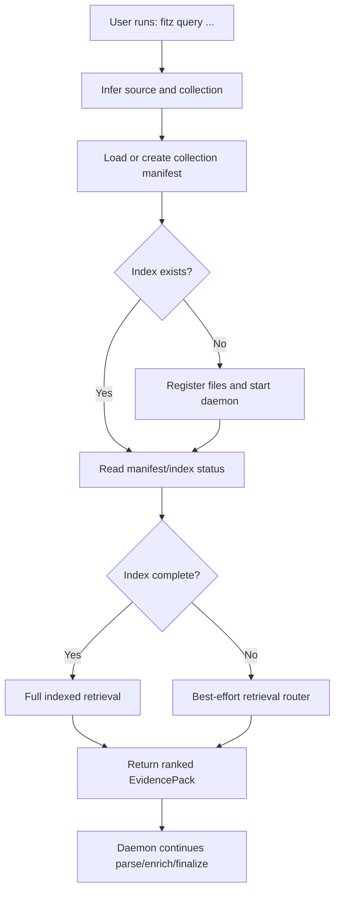

Important: the query command should not wait for a complete enriched index when
there is enough surface area to return useful best-effort evidence.

## 3. Target Retrieval Backbone

The target retrieval pipeline is three mandatory mechanics:

1. **Broad recall:** retrieve a large candidate set with cheap strategies. False
   positives are acceptable because this stage is optimized for recall. This
   stage should not try to be clever or precise.
2. **Reranking:** reorder the broad candidate list. In near-instant mode this
   can use cheap address summaries, titles, paths, and snippets. In fully
   indexed mode it should become hierarchy-aware using L1 summaries and
   document/section evidence cards.
3. **Pyrrho cutoff governance:** evaluate the ranked list incrementally until
   there is enough evidence for the query shape, a stable dispute, or a
   justified abstention.

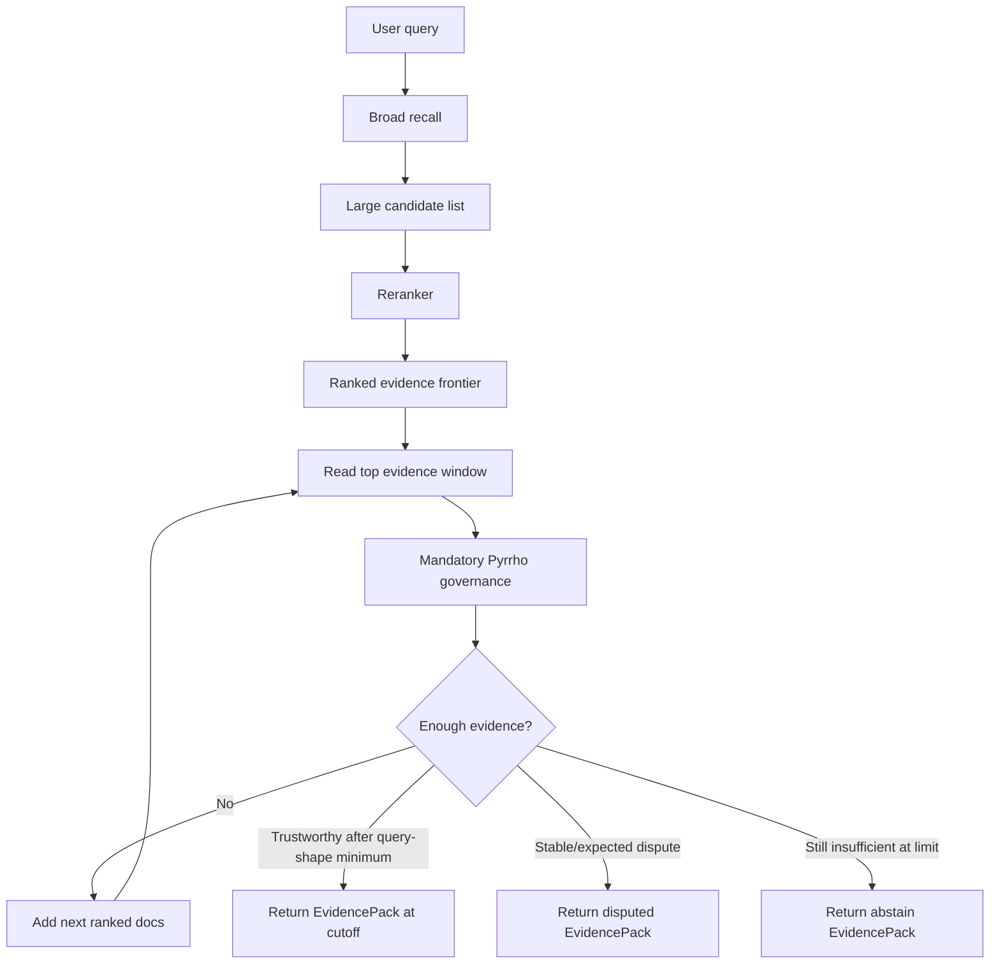

This is not an answer-generation loop. Pyrrho decides whether the retrieved
evidence frontier is sufficient for the user's query. The output remains an
EvidencePack.

The three mechanics work together to save query time:

- Broad recall avoids expensive precision work. It only needs enough semantic
  spread to avoid missing relevant documents.
- Reranking spends precision cost once on a bounded candidate list, so Pyrrho
  sees the strongest evidence first.
- Pyrrho stops the evidence loop when enough evidence has been gathered, so the
  system does not read, expand, or govern the whole candidate set.

### Pyrrho Cutoff Policy

Pyrrho should not use a single universal stop rule. The verdict is interpreted
against deterministic query shape:

| Pyrrho verdict | Narrow factual | Comparison/conflict | Broad/list/summary |
|---|---|---|---|
| `TRUSTWORTHY` | Stop once at least 1 document is present. | Stop once at least 2 documents are present. | Stop only after the broad minimum window is present. |
| `ABSTAIN` | Continue until cutoff. | Continue until cutoff. | Continue until cutoff. |
| `DISPUTED` | Continue for a small patience window; stop only if dispute persists. | Stop once at least 2 documents are present. | Do not stop early; continue to cutoff and return disputed only if conflict remains stable. |

Default knobs:

```text
max_cutoff = 10
narrow_min_docs = 1
comparison_min_docs = 2
broad_min_docs = 4
aggregation_min_docs = 5
dispute_patience_docs = 2
```

The policy stays deterministic. Qwen should not classify query shape for the
cutoff loop; deterministic comparison/aggregation/temporal/broad signals are
enough to choose the minimum evidence window.

### Broad Recall Should Stay Simple

Broad recall should probably do only three things:

1. Extract real query keywords from the user query.
2. Run a small AI semantic-keyword expansion over those real terms.
3. Run BM25 over all query terms against indexed section text. In fully indexed
   mode, also search document-level L1 summaries or evidence cards.

Optional cheap additions:

- exact identifier matching for IDs, acronyms, versions, incident codes, and
  filenames,
- table/code metadata keyword search when those indexes exist.

Broad recall should not do precision ranking, deep reasoning, agentic file
selection, or generated answers. False positives are fine. The reranker and
Pyrrho exist specifically so broad recall can stay cheap.

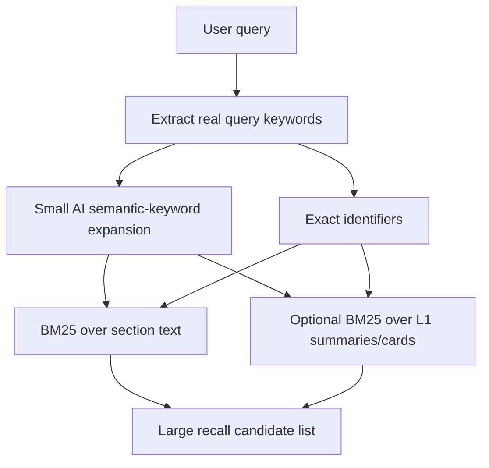

## 4. Query Pipeline Cases

### Case 1: Index incomplete, source surface under threshold

Example threshold: fewer than 10 files/items.

For small source surfaces, waiting briefly is acceptable because the user gets a
better result and the wait is bounded.

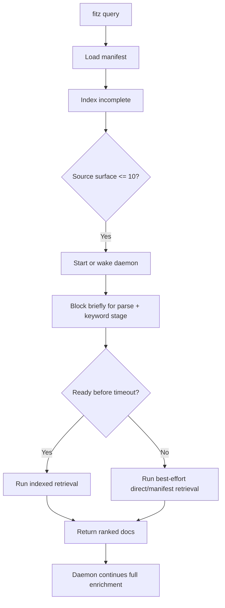

Recommended behavior:

- block briefly for parse plus fast enrichment,
- do not block indefinitely,
- return a provisional status if timeout is reached.

### Case 2: Index incomplete, source surface over threshold

For larger corpora, the user should get useful documents quickly while the
daemon works.

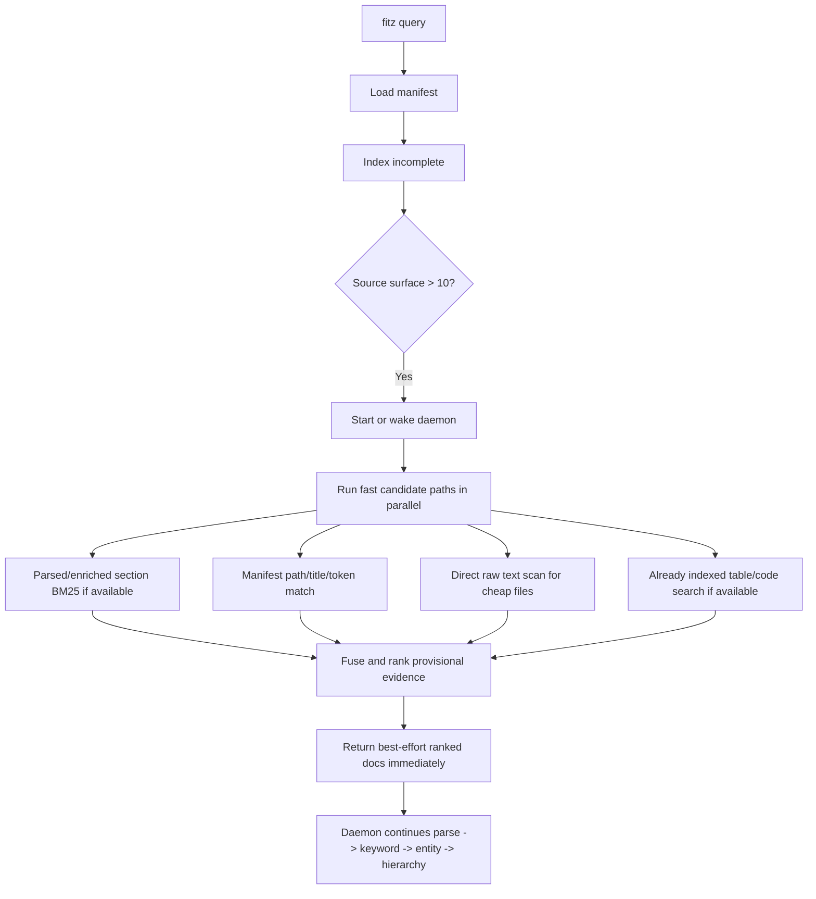

Recommended behavior:

- accept some false positives,
- prefer recall over precision for the first response,
- include `indexing_status` in the evidence pack,
- clearly mark result status as provisional.

### Case 3: Index complete

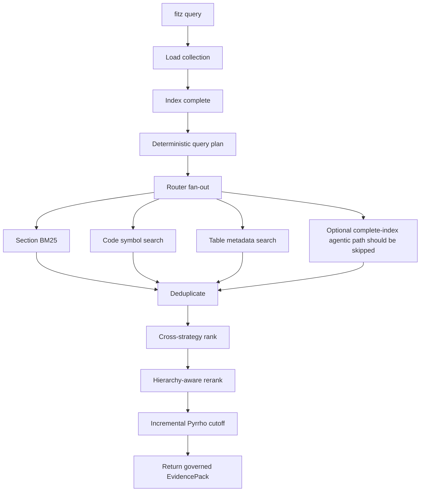

Recommended behavior:

- default query should return evidence, not generated text,
- deterministic query prep is enough for the default path,
- reranking should be latency-budgeted because it dominates query time,
- Pyrrho governance must always run, but only over the current ranked evidence
  frontier rather than an unbounded payload.

### Case 4: First query in a directory

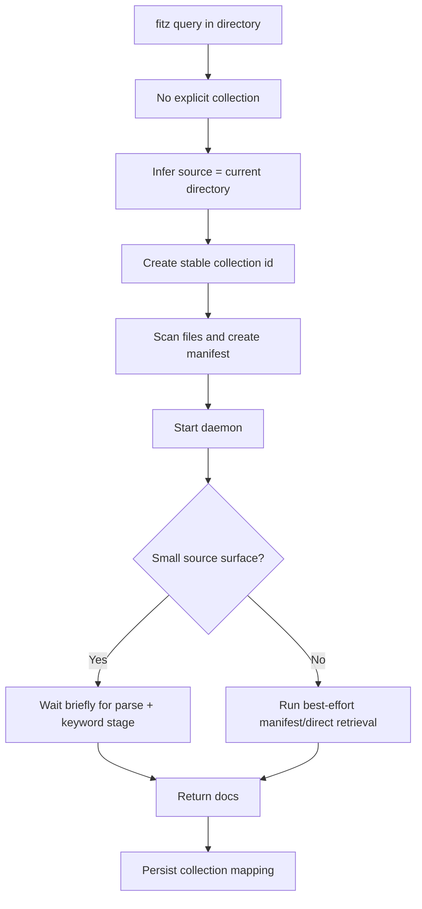

### Case 5: Source changed or stale

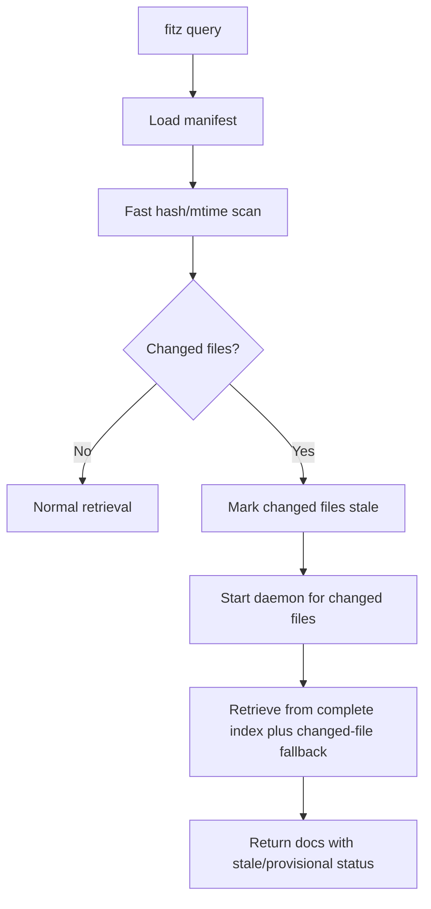

### Case 6: Daemon/enrichment failure

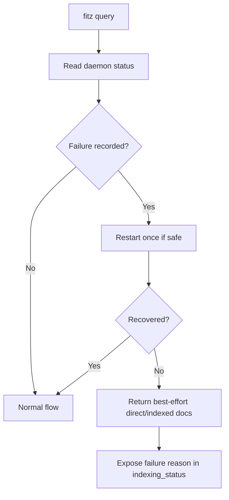

The user should still get any safe evidence that exists. A failed enrichment
batch must not make the whole product appear unusable if parse/direct retrieval
can surface relevant documents.

## 5. Retrieval Strategies We Have

Current strategies in `fitz_sage/engines/fitz_krag/retrieval/strategies/`:

| Strategy | Class | Current role | Notes |
|---|---|---|---|
| Section BM25 | `SectionSearchStrategy` | Main document retrieval path | SQLite FTS5 over title/content, then keyword-enrichment and freshness boosts. |
| Code hybrid | `CodeSearchStrategy` | Symbol retrieval | Symbol-name keyword search plus symbol FTS5 BM25. |
| LLM code search | `LlmCodeSearchStrategy` | Structural code file selection | Qwen/chat selects relevant files from AST manifest, then fallback to hybrid. Too expensive for instant default. |
| Table metadata | `TableSearchStrategy` | Table discovery | Keyword search over table name/columns. |
| Agentic manifest search | `AgenticSearchStrategy` | Unindexed-file fallback | Manifest path/token BM25 for small sets or LLM file selection for larger unindexed sets. |
| Cross-strategy ranker | `CrossStrategyRanker` | Fusion/ranking | Applies strategy weights and query-entity bonuses. |
| ONNX reranker | `AddressReranker` | Precision rerank | Cross-encoder over address summaries; improves precision but dominates latency. |
| Content reader | `ContentReader` | Reads evidence content | Turns addresses into source content/excerpts. |
| Context expander | `CodeExpander` | Adds related context | Uses imports, references, and entity graph expansion. |
| Pyrrho governance | `Pyrrho` / governance layer | Mandatory sufficiency and honesty gate | Decides trustworthy/disputed/abstain over incremental evidence windows. |

The cheap core is section/code/table/manifest candidate generation.
The expensive pieces are model-backed code/agentic search, ONNX reranking, and
Qwen enrichment/summarization.

## 6. Retrieval Cost Measurements

Measured locally on `rag_test_corpus`, complete index:

- manifest entries: 63,
- raw files: 64,
- real document sections: 299,
- total section rows including corpus summary: 300,
- symbols: 0,
- tables: 1.

The numbers are local measurements, not universal benchmarks. They are still
useful because the order of magnitude is clear.

### Candidate strategies

| Strategy | Median | P95 / max | Hits in this corpus |
|---|---:|---:|---:|
| Section FTS5 BM25 | 9.6 ms | p95 11.5 ms | 50 |
| Code hybrid keyword/BM25 | 2.0 ms | p95 2.9 ms | 0, no symbols in corpus |
| Table metadata keyword | 0.8 ms | p95 1.1 ms | 0 for test queries |
| Agentic manifest, no LLM | 1.5 ms | p95 2.0 ms | median 7.5 |
| Agentic manifest, Qwen | 16.9 s once | also logged a connection failure | 1 |

### Query pipeline stages

| Stage | Median | P95 / max |
|---|---:|---:|
| Router fan-out + fusion | 26.9 ms | p95 74.5 ms |
| ONNX reranker | 2.0 s | p95 2.9 s, max 8.1 s |
| Content reader after rerank | 28.2 ms | p95 42.1 ms |
| Deterministic query prep | 0.14 ms | p95 0.19 ms |
| Full `engine.evidence(top_k=8)` default | 2.6 s | p95 5.0 s |
| Diagnostic: no rerank, no governance, `top_read=8` | 60 ms | p95 99 ms |

Conclusion: first-pass retrieval can be instant. BM25/search is not the
problem. Reranking, governance over large untrimmed payloads, and any Qwen
query-time paths are the problem.

The diagnostic no-governance number is not a target product mode. Governance is
mandatory. The target optimization is to feed Pyrrho a small, incrementally
expanded ranked frontier instead of skipping it.

## 7. Qwen Enrichment Bus

The managed local model is fixed:

- Qwen3.5 0.8B,
- ONNX runtime,
- `onnx-community/Qwen3.5-0.8B-Text-ONNX`,
- `onnx/model_q4.onnx`,
- no llama.cpp,
- no GGUF backend.

Current document enrichment path:

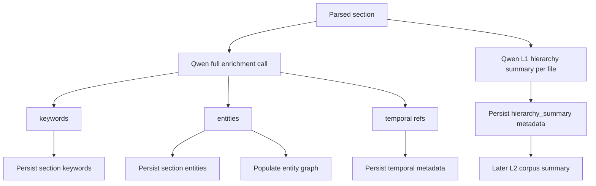

Current full enrichment asks Qwen for:

- keywords,
- entities,
- temporal references.

For document files, `enrich_file()` also generates an L1 hierarchy summary.
Corpus `finalize()` later generates the L2 corpus summary.

## 8. Qwen Enrichment Cost Measurements

Measured directly against managed Qwen ONNX on three long representative
sections from `rag_test_corpus`.

| Qwen task | Median / measured cost | Notes |
|---|---:|---|
| First Qwen chat call in process | 6.44 s | Cold-ish model/session startup plus generation. |
| Current full section enrichment | median 4.07 s/section | Range 3.26 s to 8.96 s. |
| Current full batch of 3 sections | 13.28 s total | About 4.43 s/item; batching did not help. |
| Keywords only | median 1.08 s/section | All 3 parsed successfully. |
| Keywords + entities | median 4.26 s/section | Similar to full enrichment. |
| Temporal only | median 2.50 s/section | Expensive and low current retrieval impact. |
| L1 hierarchy summary, 192-token cap | 4.20 s once | One document group summary. |

Corpus-level rough estimate for the measured corpus:

| Plan | Approximate cost |
|---|---:|
| Current full section enrichment only | about 20 minutes |
| Current full section enrichment plus L1 summaries | about 24-25 minutes |
| Keywords-only section enrichment | about 5.4 minutes |

The important result: a keywords-only Qwen path is roughly 4x cheaper than the
current full enrichment prompt and feeds the field that directly affects ranking.

## 9. Enrichment Field Impact

Measured/current field coverage in `rag_test_corpus`:

| Field | Coverage | Current retrieval impact |
|---|---:|---|
| Keywords | 299/299 sections, median 6 | Directly used by `apply_keyword_enrichment_boost()`. |
| Entities | 175/299 sections, median 1 | Feeds entity graph expansion and gap context. |
| Temporal | 63/299 sections | Stored in metadata, weak direct ranking use today. |
| Hierarchy summary | 299/299 sections | Supports broad/corpus summaries, not needed for first exact-doc retrieval. |

Keyword boost usage on sample queries:

| Query | Enriched keyword hit sections |
|---|---:|
| `What are the key facts in this corpus?` | 0 |
| `Was Incident 17B a security incident?` | 5 |
| `What changed in April 2024 customer feedback?` | 4 |
| `Which documents mention session timeout TC-1003?` | 1 |
| `Compare Q1 and Q2 feedback themes` | 1 |
| `Which documents are relevant to product roadmap risks?` | 1 |

Entity graph stats:

- 428 entities,
- 599 entity-to-section edges,
- top entities included repeated corpus-specific organizations/concepts.

Interpretation:

- Keywords are highest ROI for immediate retrieval.
- Entities are useful second-stage enrichment for related-context recall.
- Temporal should mostly be deterministic extraction unless current retrieval
  starts using temporal metadata directly.
- Hierarchy summaries are valuable for broad/corpus-level queries but should not
  block the first useful result.

## 10. Minimum AI Enrichment Contract

The minimum AI enrichment needed for near-instant querying is not the current
full enrichment bus. It is the smallest mandatory set that makes broad recall
and Pyrrho cutoff useful before the fully indexed hierarchy path is ready.

| Enrichment | Query-ready gate? | Why |
|---|---:|---|
| Deterministic identifiers | Yes, but not AI | IDs, versions, acronyms, camel-case names, and exact codes should be extracted without Qwen. |
| Qwen keywords and aliases | Yes | Highest measured ROI. Directly improves broad recall and keyword boosts. |
| Qwen L1 summaries / hierarchy cards | No for near-instant query | Valuable for fully indexed querying and stronger reranking, but should not block first query readiness. |
| Qwen entities/concept anchors | Mandatory later stage | Feeds entity graph expansion and related-context recall. Useful, but expensive enough to stage. |
| Temporal extraction | Deterministic first | Qwen temporal extraction is expensive and weakly used today; regex/date/version extraction is enough until temporal metadata drives ranking. |
| Full section summaries everywhere | No | Valuable for warm precision, but too expensive as the first query-readiness gate. |

Minimum query-ready AI enrichment:

```text
parsed units
  -> deterministic identifiers
  -> Qwen keywords / aliases
  -> query-ready
```

Full mandatory enrichment continues after query readiness:

```text
query-ready units
  -> Qwen entities / concept anchors
  -> entity graph
  -> L1 hierarchy summaries / evidence cards
  -> L2 corpus rollup
  -> fully enriched collection
```

## 11. Recommended Staged Enrichment Design

Enrichment should stay mandatory, but not monolithic.

Replace a single terminal `ENRICHED` gate with staged readiness:

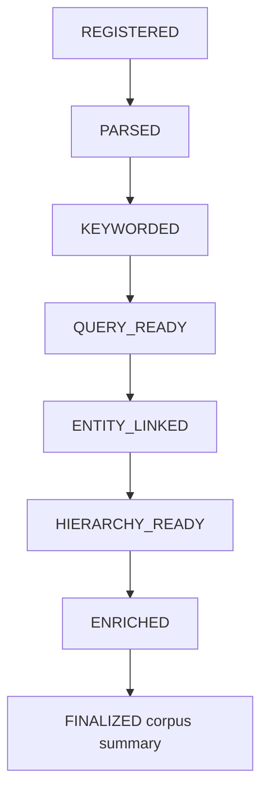

Meaning:

| State | Required work | Query behavior |
|---|---|---|
| `REGISTERED` | Manifest knows the file exists | Manifest/path fallback only. |
| `PARSED` | Raw content and sections/symbols/tables stored | BM25 can run. |
| `KEYWORDED` | Deterministic identifiers plus Qwen keywords | Broad recall has high-ROI enrichment. |
| `QUERY_READY` | Parsed and keyworded | First governed query can return. |
| `ENTITY_LINKED` | Entities extracted and graph populated | Better related-context expansion. |
| `HIERARCHY_READY` | L1 file summaries/evidence cards generated | Fully indexed reranking has hierarchy signal. |
| `ENRICHED` | All mandatory per-file enrichment done | Fully warmed file. |
| `FINALIZED` | Corpus-level summary built | Fully warmed collection. |

The key product decision:

`QUERY_READY` is enough to answer the first `fitz query` with governed ranked
documents using keyword recall. `ENRICHED` is still required for the finished
index and the hierarchy-aware precision path.

## 12. Proposed Query-Time Router

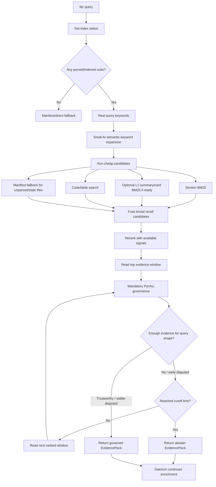

Default instant mode should avoid:

- heavy all-in-one Qwen query intelligence,
- Qwen agentic file selection,
- LLM code search,
- ONNX rerank over very large candidate sets when the user expects immediate output,
- Pyrrho over large untrimmed content payloads.

It should use:

- deterministic query keyword extraction,
- a small AI semantic-keyword expansion call,
- section BM25,
- code/table keyword search,
- enriched keyword boosts when available,
- manifest/direct fallback for not-yet-indexed files,
- rerank over a bounded candidate set with whatever signals are ready,
- top-window-limited reading,
- mandatory incremental Pyrrho cutoff.

## 13. Current Bug/Product Mismatch Found

`AgenticSearchStrategy` is intended for unindexed files, but the current
condition uses files not in `SUMMARIZED` state.

The current manifest uses `ENRICHED` as terminal for the eager phase. Therefore
files can be complete according to indexing status but still considered
agentic-search candidates because they are not `SUMMARIZED`.

This creates unnecessary fallback work and confusing semantics.

Fix direction:

- treat `ENRICHED` as query-complete,
- reserve `SUMMARIZED` or future states for warm summaries,
- make agentic fallback target truly unparsed/unqueryable files only.

## 14. Practical Next Implementation Slice

First slice should be small and high impact:

1. Split enrichment into keyword extraction vs deep enrichment.
2. Add staged manifest states: `KEYWORDED`, `QUERY_READY`, `ENTITY_LINKED`,
   `HIERARCHY_READY`.
3. Make `fitz query` run broad recall, rerank with available signals, and
   mandatory Pyrrho cutoff over incremental evidence windows.
4. Add a constrained query-semantic-keyword expansion path instead of using the
   current broad all-in-one query intelligence bus.
5. Keep daemon running deep enrichment in the background.
6. Fix agentic strategy gating so complete/enriched files are not treated as
   unindexed.
7. Make ONNX reranking bounded by candidate size and latency budget, not skipped
   entirely.

This preserves the principle that enrichment is not optional while avoiding the
current behavior where every section pays the full Qwen enrichment bus before
the product feels usable.

## 15. Open Design Questions

These need decisions before implementation:

1. What is the exact small-surface threshold: 10 files, 10 parsed units, or 10
   source documents?
2. What is the default instant latency budget: 100 ms, 250 ms, 500 ms, or 1 s?
3. What candidate count should feed the hierarchy-aware reranker by default:
   50, 100, or 200?
4. Should broad/corpus queries wait longer for hierarchy summaries than narrow
   exact-match queries?
5. Should temporal Qwen extraction be removed entirely in favor of deterministic
   regex extraction until temporal metadata is used in ranking?
6. Should aggregation/list queries use a higher minimum than 5 documents for
   large corpora?
7. What incremental Pyrrho windows should we use after the first 10 documents:
   `1, 2, 3, 5, 8, 13, 20` or a flatter sequence such as `3, 5, 10, 20`?
8. What is the default hard cutoff when Pyrrho still cannot find sufficient
   evidence: top 10 documents, top 20 sections, or a token budget?

## 16. Bottom Line

The full picture is:

- BM25 and local candidate search are already cheap.
- Qwen enrichment is valuable but currently too broad and too slow as one
  blocking gate.
- The minimum near-instant AI enrichment is Qwen keywords/aliases. L1 summaries
  and hierarchy/evidence cards are deferred to fully indexed querying.
- Entities and hierarchy are valuable, but should be staged after keyworded
  query readiness.
- Temporal metadata is currently the weakest ROI Qwen task.
- Broad recall only needs real query keywords, a small AI semantic expansion,
  and BM25 over those terms.
- Reranking is central because it prepares the evidence order for Pyrrho and
  prevents Pyrrho from wasting work on low-value documents.
- Pyrrho governance is mandatory and should decide the evidence cutoff
  incrementally.
- The desired UX is feasible if the query path returns best-effort ranked docs
  from parsed/keyworded/direct sources while the daemon continues full
  mandatory enrichment.
